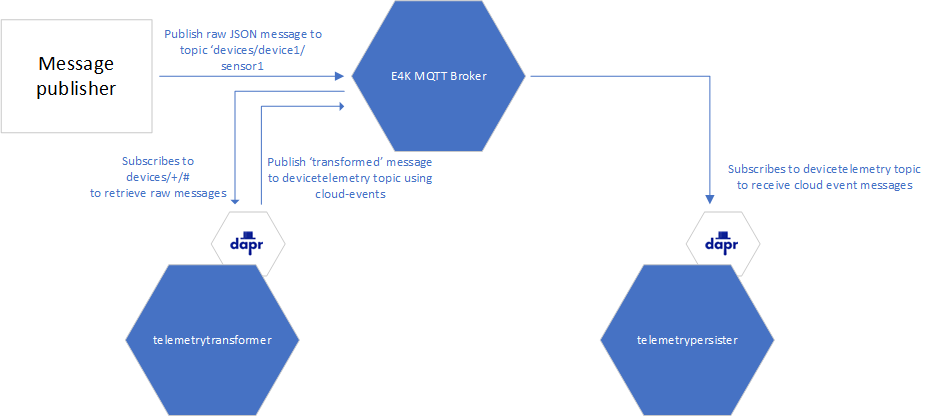

## Introduction

This sample shows how you can use Dapr in .NET projects to receive messages from an MQTT topic and publish messages to another MQTT topic.

## Prerequisites

- [Docker Desktop](https://www.docker.com/products/docker-desktop/) or [Rancher Desktop](https://rancherdesktop.io/) to be able to build the container images on your computer
- [Powershell](https://learn.microsoft.com/en-us/powershell/scripting/install/installing-powershell?view=powershell-7.3) installed on your computer to be able to use the build and deploy powershell scripts
- A Kubernetes cluster where Dapr and Azure IoT Operations is installed
- A Container Registry where docker images can be pushed to
- A pullsecret for the Container Registry must exist in the Kubernetes cluster. The pullsecret must have the name `aio-pullsecret`.  Information on how to create a pull secret for an Azure Container Registry can be found [here](https://learn.microsoft.com/en-us/azure/container-registry/container-registry-auth-kubernetes#create-an-image-pull-secret).  More generic information on how to create a pull secret can be found [here](https://kubernetes.io/docs/tasks/configure-pod-container/pull-image-private-registry/).

## Overview

This sample consists of two .NET workloads that are communicating with each other via the IoT MQ broker.



- Raw JSON messages are published to the IoT MQ MQTT broker
- The `telemetrytransformer` component is implemented as a Console Application that uses Dapr pub/sub to receive (non cloud-event) raw messages from the IoT MQ broker
- The `telemetrytransformer` publishes cloud-event messages to the IoT MQ broker
- The `telemetrypersister` component is implemented as an ASP.NET Web API project that uses Dapr pub/sub to receive cloud-event messages from the IOT MQ broker
- The `telemetrypersister` has an additional subscription where Dapr is used to receive non cloud-event messages from an MQTT topic.

## How to build and deploy

- Build the .NET components using the `build.ps1` powershell script file.
  This script takes 2 parameters:
  - Version:  this parameter is used to assign a tag to the container images that are being build for the `telemetrytransformer` and `telemetrypersister` component.
  - ContainerRegistry: the URL of the container registry to where the images must be pushed.

- Deploy the sample to your Kubernetes cluster by using the `deploy.ps1` powershell script.
  This script takes 3 parameters:
  - ContainerRegistry: the URL of the container registry where the images reside.
  - Version: the version of the `telemetrytransformer` and `telemetrypersister` components that you want to deploy
 
## Test the sample

You can test the sample by publishing JSON messages to the `devices/+/#` MQTT topic on the IOT MQ broker.

To do this, you first need to find out the external IP address that you can use to send messages to IoT MQ. You need the IP address of the IoT MQ aio-mq-dmqtt-frontend service.

To do this, execute the `kubectl get svc -n azure-iot-operations` command.
This command will show all the services that exist in the namespace. One of those services is the `aio-mq-dmqtt-frontend` service.  Use the external IP address of that service in the following command:

> [!NOTE]
> The mosquitto pub needs to switch to a different auth, or we need to enable username/password. Maybe switch this to a mqtt client deployed onto the cluster similar to other tutorials

```
mosquitto_pub -h <dmqtt-frontend-ip> -t "devices/device1/sensor1" -m '{"Tag":"fan_speed","Value":35,"Timestamp":"2023-07-03T18:20:00Z"}' -q 1 -u client1 -P password
```

After you've published a message via the command above, you should see some information in the logs of the `telemetrytransformer` pod.  For instance:

To get the name of the pod for which to retrieve the logs, execute this command:

```
kubectl get pods -n azure-iot-operations
```

```
kubectl logs -n azure-iot-operations telemetrytransformer-75cf9f8978-47fqm
```
shows:
```
<6>2023-07-04 07:54:17.711 +00:00 TelemetryTransformer.Services.DeviceTelemetryReceiver[0] OnTopicEvent called on topic devices/device1/sensor2
<6>2023-07-04 07:54:17.711 +00:00 TelemetryTransformer.Services.DeviceTelemetryReceiver[0] payload = {"Tag":"fan_speed","Value":37,"Timestamp":"2023-07-04T18:20:00Z"}
Received message: {"Tag":"fan_speed","Value":37,"Timestamp":"2023-07-04T18:20:00Z"}
Message deserialized:
Timestamp = 07/04/2023 18:20:00 +00:00
Tag = fan_speed
Value = 37
<6>2023-07-04 07:54:17.712 +00:00 TelemetryTransformer.Services.DeviceTelemetryReceiver[0] Publishing message ...
<6>2023-07-04 07:54:17.760 +00:00 TelemetryTransformer.Services.DeviceTelemetryReceiver[0] Message published.
```

Since the `telemetrytransformer` worker has published a new message to the IoT MQ broker, and the `telemetrypersister` worker is listening to the specific topic where the message has been sent to, you should see that the `telemetrypersister` has done some work as well.

Displaying the logs of the `telemetrypersister` should show this:

Again, first  get the exact name of the pod by executing this command:

```
kubectl get pods -n azure-iot-operations
```

Once you have the name of the pod, execute this command:

```
kubectl logs -n azure-iot-operations telemetrypersister-7fcf59885d-fd9qb
```

```
<6>2023-07-04 07:54:17.784 +00:00 TelemetryPersister.Controllers.DeviceTelemetryController[0] DeviceTelemetry message received
<6>2023-07-04 07:54:17.784 +00:00 TelemetryPersister.Controllers.DeviceTelemetryController[0] Persisting telemetry for device: {"deviceId":"device1","timestamp":"2023-07-04T18:20:00+00:00","tag":"fan_speed","value":37}
```

The `telemetrypersister` also contains a subscription on a topic where raw payloads (no cloudevents) are expected.
This subscription is listening on the `commands/#` topic.

To test this, publish a JSON message to the `commands/#` topic in the IoT MQ broker:

> [!NOTE]
> The mosquitto pub needs to switch to a different auth, or we need to enable username/password. Maybe switch this to a mqtt client deployed onto the cluster similar to other tutorials

```
mosquitto_pub -h <dmqtt-frontend-ip> -t "commands/exec" -m '{"cmd":"reboot"}' -q 1  -u client1 -P password
```

The logs of the `telemetrypersister` should show this:

```
<6>2023-07-04 14:14:56.860 +00:00 TelemetryPersister.Controllers.DeviceTelemetryController[0] Command received: reboot
```

> Be aware that in this sample, all loglevels are set to 'Debug'.  This means a lot of logs are generated, which is obviously not something you want to do by default in production scenarios!

## Acknowledgements

Big thanks to [Frederik Gheysels](https://github.com/fgheysels) for contributing this sample!
