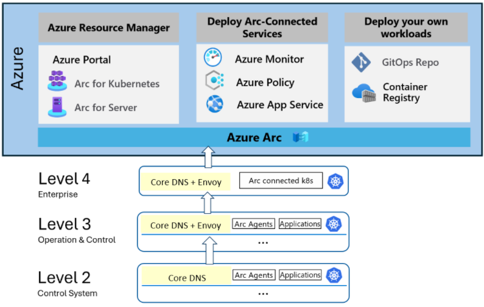

# Layered networking guidance

In industries like manufacturing, you often see segmented networking architectures that create layers. These layers minimize or block lower-level segments from connecting to the internet (for example, [Purdue Network Architecture](https://en.wikipedia.org/wiki/Purdue_Enterprise_Reference_Architecture)).

This article demonstrates that Azure IoT Operations can be installed and managed in a layered network using open, industry-recognized software. It does not recommend specific practices or provide production-ready implementation, configuration, or operations details. For those details, see the [Azure IoT Operations production checklist](https://learn.microsoft.com/en-us/azure/iot-edge/production-checklist). This article also does not make recommendations about networking architecture.

This article covers:

- Kubernetes-based configuration and compatibility with networking primitives
- Connecting devices in layered networks at scale to [Azure Arc](https://learn.microsoft.com/en-us/azure/azure-arc/) for remote management and configuration from a single Azure control plane
- Security and governance across network levels for devices and services with URL and IP allow lists and connection auditing

## Key features

This article demonstrates how to deploy Azure IoT Operations in a layered network environment and uses it to route telemetry from assets on the edge to Azure services in the cloud.

## Next steps

1. Learn [How Azure IoT Operations Works in a layered network](./aio-layered-network.md).
1. Learn how to use CoreDNS and Envoy Proxy in [Configure the infrastructure](./configure-infrastructure.md).
1. Learn how to Arc enable the K3s clusters in [Arc enable the K3s clusters](./arc-enable-clusters.md).
1. Learn how to deploy Azure IoT Operations to the clusters in [Deploy Azure IoT Operations](./deploy-aio.md).
1. Learn how to flow asset telemetry through the deployments into Azure Event Hubs in [Flow asset telemetry](./asset-telemetry.md).
