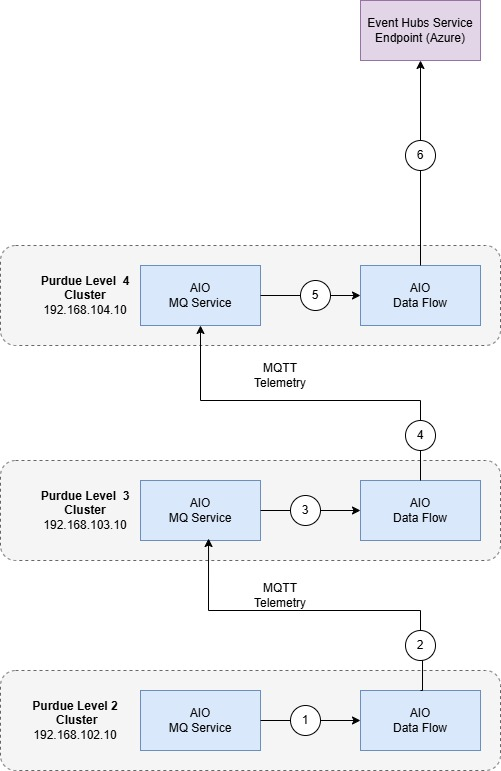

# How Azure IoT Operations works in a layered network

Deploy Azure IoT Operations in a layered network environment by following the guidance in this article. Azure IoT Operations works in industrial network environments that have multiple isolated network segments, typically layered like those in Purdue Network architecture.

## Industrial Scenario for Azure IoT Operations

In the basic architecture described in [Azure IoT Operations Architecture Overview](https://learn.microsoft.com/en-gb/azure/iot-operations/overview-iot-operations#architecture-overview), all Azure IoT Operations components are deployed to a single internet-connected cluster. In this environment, component-to-component and component-to-Azure connections are enabled by default.

But in many industrial scenarios, computing units for different purposes are in separate networks. For example:

- Assets and servers on the factory floor
- Data collection and processing solutions in the data center
- Business logic applications with information workers

Sometimes, the network design has a single isolated network behind a firewall or physically disconnected from the internet. Other times, a more complex layered network topology is used, like the [Purdue Network architecture](https://en.wikipedia.org/wiki/Purdue_Enterprise_Reference_Architecture).

This guidance helps you connect Azure and clusters in different types of layered network environments. Azure IoT Operations works in both top-level and nested layers as needed.

## How does this guidance work?

The following diagram shows how to redirect traffic from a layered network to Azure Arc. It explains the underlying logic. For steps to set up this mechanism, see [Arc enable the K3s clusters](./arc-enable-clusters.md).

### Arc Bound Data Flow

1. When Level 2 Arc Agentry attempts to connect to its corresponding cloud service it uses the Level 2 Core DNS to resolve the cloud service name.
1. The Level 2 Core DNS returns the IP Address of the Level 3 Envoy Proxy (192.168.103.10) which is listening on port 443/8084 (Arc required ports)
1. The Arc Agentry connects to the endpoint of the Envoy Proxy operating in Level 3 on port 443/8084.
1. The Envoy Proxy in level 3 uses the level 3 Core DNS to resolve the cloud service name.
1. The Level 3 Core DNS returns the IP Address of the Level 4 Envoy Proxy (192.168.104.10) which is listening on port 443/8084 (Arc required ports)
1. The Envoy Proxy operating in Level 3 connects to the Envoy Proxy operating in Level 4 on port 443/8084.
1. The Envoy Proxy in level 4 uses the Enterprise DNS to resolve the cloud service name.
1. The Enterprise DNS returns the "real" IP of the cloud services
1. The Envoy Proxy operating in Level 4 connects to the cloud service on port 443/8084.

> [!NOTE]
> Traffic is forwarded through Envoy Proxy only when it's on the destination allow list.

### Event Hubs bound data flow

1. Level 2 AIO Data Flow receives a new message based on its "filters"
1. Level 2 AIO Data Flow sends the MQTT message, potentially after transforming, to AIO MQTT Broker service running on level 3
1. Level 3 AIO Data Flow receives a new message based on its "filters"
1. Level 3 AIO Data Flow sends the MQTT message, potentially after transforming, to AIO MQTT Broker service running on level 4
1. Level 4 AIO Data Flow receives a new message based on its "filters"
1. Level 4 AIO Data Flow sends the MQTT message, potentially after transformation, to Event Hubs

> [!NOTE]
> Traffic is terminated at each level, following typical segmentation practices. This lets you transform and operate on data for departmental workloads.

## Example of Azure IoT Operations in a layered network

This diagram shows Azure IoT Operations deployed to multiple clusters in different network segments. In the Purdue Network architecture, level 4 is the enterprise network, level 3 is the operation and control layer, and level 2 is the controller system layer. Only level 4 has direct internet access, and the other levels can only communicate with their adjacent levels.

<!-- To Do:  The following diagram must be updated with Core DNS Envoy Proxy, Data Flows and MQTT** -->

In this example, Azure IoT Operations is deployed to levels 2 through 4. At levels 3 and 4, the Envoy Proxy is deployed, and levels 2 and 3 have Core DNS set up to resolve the whitelisted URI to the parent cluster, which directs them to the parent Envoy Proxy. This setup redirects traffic from the lower layer to the parent layer. It lets you Arc-enable clusters and keep an Arc-enabled cluster running.

With extra configuration, you can use this technique to direct traffic east-west. This route lets Azure IoT Operations components send data to other components at upper levels and create data pipelines from the bottom layer to the cloud. In a multilayer network, you can deploy Azure IoT Operations components across layers based on your architecture and data flow needs. This example gives you general ideas about where to place individual components.

- Place the connector for OPC UA at the lower layer, closer to your assets and OPC UA servers.
- Transfer data toward the cloud through the MQTT Broker components in each layer.
- Use the Data Flows component on nodes with enough compute resources, because it typically uses more compute.

## Next steps

1. Learn how to use CoreDNS and Envoy Proxy in [Configure the infrastructure](./configure-infrastructure.md).
1. Learn how to Arc enable the K3s clusters in [Arc enable the K3s clusters](./arc-enable-clusters.md).
1. Learn how to deploy Azure IoT Operations to the clusters in [Deploy Azure IoT Operations](./deploy-aio.md).
1. Learn how to flow asset telemetry through the deployments into Azure Event Hubs in [Flow asset telemetry](./asset-telemetry.md).

