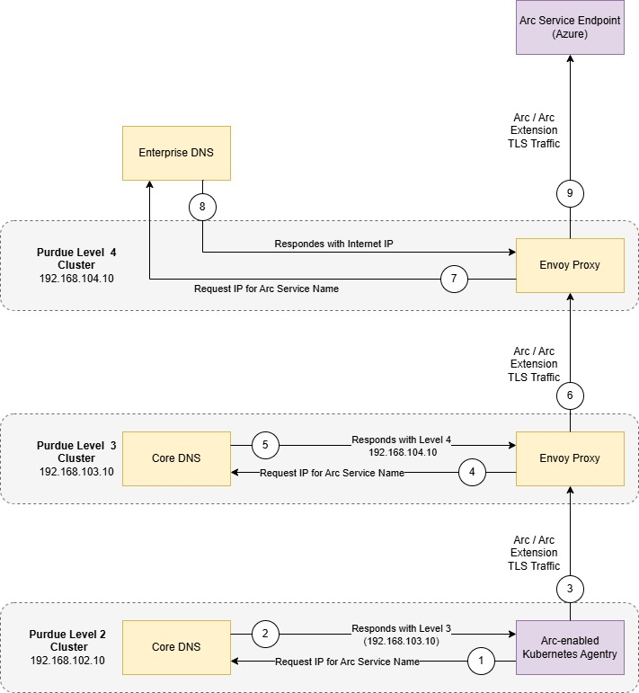
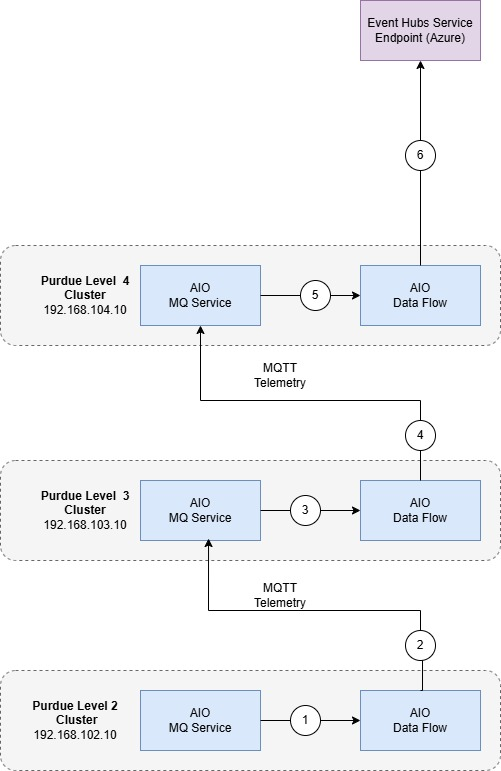

# How Azure IoT Operations Works in a Segmented Network

You can deploy Azure IoT Operations in a segmented network environment by using the guidance provided in this document. This enables Azure IoT Operations to function in industrial network environments that have multiple isolated network segments (typically layered such as found in Purdue Network architecture).

## Industrial Scenario for Azure IoT Operations

In the basic architecture described in [Azure IoT Operations Architecture Overview](https://learn.microsoft.com/en-gb/azure/iot-operations/overview-iot-operations#architecture-overview), all the Azure IoT Operations components are deployed to a single internet-connected cluster. In this type of environment, component-to-component and component-to-Azure connections are enabled by default.

However, in many industrial scenarios, computing units for different purposes are located in separate networks. For example:

- Assets and servers on the factory floor
- Data collecting and processing solutions in the data center
- Business logic applications with information workers

In some cases, the network design includes a single isolated network that is located behind the firewall or is physically disconnected from the internet. In other cases, a more complicated layered network topology is configured, such as the [Purdue Network architecture](https://en.wikipedia.org/wiki/Purdue_Enterprise_Reference_Architecture).

This guidance is designed for facilitating connections between Azure and clusters in different kinds of isolated network environments. Enabling Azure IoT Operations to function in top-level isolated layers and nested isolated layers as needed.

## How does this Guidance Work?

The following diagram describes the mechanism to redirect traffic from an isolated network to Azure Arc. It explains the underlying logic. For information on specific steps to achieve this mechanism see [Configure Arc and Arc Extension communications](./Configure Arc and Arc Extension Communications.md).

### Arc Bound Data Flow

1. When Level 2 Arc Agentry attempts to connect to its corresponding cloud service it uses the Level 2 Core DNS to resolve the cloud service name.
2. The Level 2 Core DNS returns the IP Address of the Level 3 Envoy Proxy (192.168.103.10) which is listening on port 443/8084 (Arc required ports)
3. The Arc Agentry connects to the endpoint of the Envoy Proxy operating in Level 3 on port 443/8084.
4. The Envoy Proxy in level 3 uses the level 3 Core DNS to resolve the cloud service name.
5. The Level 3 Core DNS returns the IP Address of the Level 4 Envoy Proxy (192.168.104.10) which is listening on port 443/8084 (Arc required ports)
6. The Envoy Proxy operating in Level 3 connects to the Envoy Proxy operating in Level 4 on port 443/8084.
7. The Envoy Proxy in level 4 uses the Enterprise DNS to resolve the cloud service name.
8. The Enterprise DNS returns the "real" IP of the cloud services
9. The Envoy Proxy operating in Level 4 connects to the cloud service on port 443/8084.

> [!NOTE]
> Traffic is only forwarded through Envoy Proxy when it is on the destination allow list

### Event Hubs Bound Data Flow

1. Level 2 AIO Data Flow receives a new message based on its "filters"
2. Level 2 AIO Data Flow sends the MQTT message, potentially after transforming, to AIO MQ Service running on level 3
3. Level 3 AIO Data Flow receives a new message based on its "filters"
4. Level 3 AIO Data Flow sends the MQTT message, potentially after transforming, to AIO MQ Service running on level 4
5. Level 4 AIO Data Flow receives a new message based on its "filters"
6. Level 4 AIO Data Flow sends the MQTT message, potentially after transformation, to Event Hubs

> [!NOTE]
> Traffic is  terminated at each level adhering to typically segmented practices and enabling the ability to perform transformations and operations on the data for departmental workloads.

## Example of Azure IoT Operations in a Segmented Network

The following diagram is an example of Azure IoT Operations being deployed to multiple clusters in multiple network segments. Based on the Purdue Network architecture, Level 4 is the enterprise network, Level 3 is the operation and control layer, and Level 2 is the controller system layer. Only level 4 has direct internet access and the others are limited to communications with their adjacent levels.

**/// To Do:  The following diagram must be updated with Core DNS Envoy Proxy, Data Flows and MQTT**

In the pictured example, Azure IoT Operations is deployed to level 2 through level 4. At level 3 and level 4 the Envoy Proxy is deployed and level 2 and level 3 have the Core DNS configured to resolve the white listed URI to the parent cluster (resulting in them being directed to the parents Envoy Proxy). This results in the traffic coming from the lower layer to be redirected by the parent layer. This ultimately results in the ability to Arc-enable clusters and maintain an Arc-enabled cluster. 

With extra configurations this same technique can be used to direct traffic east-west. This route enables Azure IoT Operations components to send data to other components at upper level and form data pipelines from the bottom layer to the cloud. In a multi-layer network, the Azure IoT Operations components can be deployed across layers based on your architecture and data flow needs. This example provides some general ideas of where individual components will be placed.

- The connector for OPC UA may locate at the lower layer that is closer to your assets and OPC UA servers
- The data shall be transferred towards the cloud side through the MQ components in each layer
- The Data Flows component is generally a component that uses more compute so usage should be aligned to node sizes

## Previous Steps

1. [Overview](./README.md)

## Next Steps

1. Learn how to use Core DNS and Envoy Proxy in [Configure the Infrastructure](./Configure the Infrastructure.md).
2. Learn how to [Arc enable the K3s clusters](./Arc Enabling the Clusters.md).
3. Learn how to [deploy Azure IoT Operations](./Deploying AIO.md) to the clusters.
4. Learn how to [flow asset telemetry](./Asset Telemetry.md) through the deployments into Azure Event Hubs.

## Related

For lab preparation, see [prerequisites](./prerequisites.md).