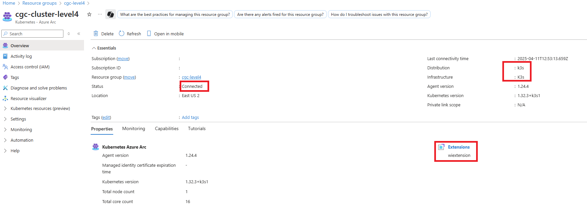

# Arc enabling the clusters

[Arc-enabled Kubernetes](https://learn.microsoft.com/en-us/azure/azure-arc/kubernetes/overview) lets you attach Kubernetes clusters running anywhere and manage them in Azure. Managing these clusters with a single control plane gives you a more consistent development and operations experience. Azure IoT Operations uses the features from this service and is deployed as an Arc extension.

To deploy Azure IoT Operations, you need to Arc enable the k3s clusters you created earlier (level2, level3, and level4). Arc enablement requires internet access, which you set up in previous steps by configuring the infrastructure (Core DNS and Envoy Proxy). This setup lets the layered network establish and maintain these connections as they operate.

## Prerequisites

- Set up the jump box as outlined in [preparing the jump box](./prerequisites.md#preparing-the-jump-box). Make sure it's set up to communicate with each cluster by switching context.

- Contributor access to an Azure subscription where the clusters connect.

- The OID for the Arc service. This requires permissions that might not be granted to all users in an enterprise, so another party might need to provide it. The easiest way to get this is in the cloud shell. Follow these steps:

    1. Open the cloud shell in the Azure portal to a Bash terminal (top right corner of the portal).

        

    1. Make sure the desired subscription is selected, then query Azure for the OID.

    ```bash
    # Set the subscription to the one that will be used for Arc enabled kubernetes cluster
    az account set -s "<Subscription_Id>"
    
    # Query for the OID and record the GUID
    az ad sp show --id ${OID} --query id -o tsv
    ```

## Set required kernel parameters on each machine

> [!IMPORTANT]
>
> For each machine that hosts Kubernetes, update the kernel parameters to at least the provided values. If overrides are in place, make sure to set these values without duplicates in the file. Without these settings, you can experience timeouts.

```bash
ssh ubuntu@192.168.10<level>.10

sudo tee -a /etc/sysctl.conf <<EOF

fs.inotify.max_user_instances=8192
fs.inotify.max_user_watches=524288
fs.file-max = 100000

EOF

sudo sysctl -p &> /dev/null

sudo systemctl restart k3s

exit
```

## Arc enable level4

1. Set the environment variables for level4 connectivity.

    ```bash
    SUBSCRIPTION_ID="<Subscription_Id>"

    # You can get a list by running
    # az account list-locations --query "sort_by([].{Location:name}, &Location)" -o table
    LOCATION="<Azure_Location>"
    RESOURCE_GROUP="<Resource_Group>"
    CLUSTER_NAME="<Cluster_Name>"

    # The OID you got in the prerequisites
    OID="<OID>"
    ```

1. Set Azure to the right subscription and set Kubernetes to target the level 4 cluster.

    ```bash
    # When prompted, copy the code and sign in to Azure using the provided link.
    az login --use-device-code

    az account set -s "${SUBSCRIPTION_ID}"

    kubectl config use-context level4
    ```

1. Add the Azure CLI extensions and register the providers required for these steps and for Azure IoT Operations installation.

    ```bash
    az extension add --name connectedk8s && az extension add --name k8s-extension && az extension add --name customlocation && az extension add --name azure-iot-ops

    az provider register -n "Microsoft.ExtendedLocation" && az provider register -n "Microsoft.Kubernetes" && az provider register -n "Microsoft.KubernetesConfiguration" && az provider register -n "Microsoft.IoTOperations" && az provider register -n "Microsoft.DeviceRegistry" && az provider register -n "Microsoft.SecretSyncController"
    ```

1. Create the resource group where the cluster connects, then establish the connection.

    ```bash
    az group create --location ${LOCATION} --resource-group ${RESOURCE_GROUP} --subscription ${SUBSCRIPTION_ID}

    # The timeout has been increased for lower levels but the same will be used in each for this demo (it takes several minutes)
    az connectedk8s connect -n ${CLUSTER_NAME} -g ${RESOURCE_GROUP} --custom-locations-oid ${OID} --onboarding-timeout 480 --enable-oidc-issuer --enable-workload-identity --disable-auto-upgrade

    az connectedk8s enable-features -n ${CLUSTER_NAME} -g ${RESOURCE_GROUP} --custom-locations-oid ${OID} --features cluster-connect custom-locations
    ```

1. During the connection, you might see the following message. You can ignore it because you provided the correct OID manually.

    

1. After the connection, you can see the new cluster in the portal.

    

    > [!NOTE]
    >
    > You can also check the connection by running the following command: `az connectedk8s list --resource-group $RESOURCE_GROUP --query '[].{name: name, distribution: distribution, infrastructure: infrastructure, status: connectivityStatus}'`.

1. Select the cluster to see items to confirm (in red squares). The distribution is set to k3s, the wiextension is installed, and the cluster is connected.

    

1. Review the Kubernetes namespaces on level4 to see that arc-workload-identity, azure-arc, and azure-arc-release are present (Arc agentry).

    ```bash
    kubectl get namespaces
    ```

    

## Arc enable level3

1. Set the environment variables for level3 connectivity.

    ```bash
    SUBSCRIPTION_ID="<Subscription_Id>"
    
    # A list can be retrieved using 
    # az account list-locations --query "sort_by([].{Location:name}, &Location)" -o table
    LOCATION="<Azure_Location>"
    RESOURCE_GROUP="<Resource_Group>"
    CLUSTER_NAME="<Cluster_Name>"
    
    # The OID retrieved in the prerequisites
    OID="<OID>"
    ```

1. Set Azure to the correct subscription and set Kubernetes to target the level3 cluster.

    ```bash
    # When prompted copy the code provided and log in to Azure using the link provided
    az login --use-device-code
    
    az account set -s "${SUBSCRIPTION_ID}"
    
    kubectl config use-context level3
    ```

1. Add the Azure CLI extensions and register the providers required for these steps and the Azure IoT Operations installation. If you're using the same session and subscription, skip this step.

    ```bash
    az extension add --name connectedk8s && az extension add --name k8s-extension && az extension add --name customlocation && az extension add --name azure-iot-ops
    
    az provider register -n "Microsoft.ExtendedLocation" && az provider register -n "Microsoft.Kubernetes" && az provider register -n "Microsoft.KubernetesConfiguration" && az provider register -n "Microsoft.IoTOperations" && az provider register -n "Microsoft.DeviceRegistry" && az provider register -n "Microsoft.SecretSyncController"
    ```

1. Create the resource group to connect the cluster, then establish the connection.

    ```bash
    az group create --location ${LOCATION} --resource-group ${RESOURCE_GROUP} --subscription ${SUBSCRIPTION_ID}
    
    # The timeout has been increased for lower levels but the same will be used in each for this demo (it takes several minutes)
    az connectedk8s connect -n ${CLUSTER_NAME} -g ${RESOURCE_GROUP} --custom-locations-oid ${OID} --onboarding-timeout 960 --enable-oidc-issuer --enable-workload-identity --disable-auto-upgrade
    
    az connectedk8s enable-features -n ${CLUSTER_NAME} -g ${RESOURCE_GROUP} --custom-locations-oid ${OID} --features cluster-connect custom-locations
    ```

1. In some lower level deployments, you might get a timeout error. If you get an error, check the directory in the message.

    Check the contents of the `cluster_diagnostic_checks_pod_description.txt` file. If it's a timeout, retry the previous command and it should succeed.

     ```bash
    cat /home/chris/.azure/pre_onboarding_check_logs/cgc-cluster-level3-Fri-Apr-11-09.07.36-2025/cluster_diagnostic_checks_pod_description.txt
    ```

    

1. During the connection, you might see the following message. You can ignore it because the correct OID is provided manually.

    

1. After the connection, you can see the new cluster in the portal.

    

1. Select the cluster to see items to confirm (in red squares).

1. The distribution is selected as k3s, the wiextension is installed, and the cluster is connected.

    

1. Review the Kubernetes namespaces on level3 to see that arc-workload-identity, azure-arc, and azure-arc-release are present (Arc agentry).

    ```bash
    kubectl get namespaces
    ```

    

## Arc enable level2

1. Set the environment variables for level2 connectivity.

    ```bash
    SUBSCRIPTION_ID="<Subscription_Id>"
    
    # A list can be retrieved using 
    # az account list-locations --query "sort_by([].{Location:name}, &Location)" -o table
    LOCATION="<Azure_Location>"
    RESOURCE_GROUP="<Resource_Group>"
    CLUSTER_NAME="<Cluster_Name>"
    
    # The OID retrieved in the prerequisites
    OID="<OID>"
    ```

1. Set Azure to the right subscription and Kubernetes to target the level 2 cluster.

    ```bash
    # When prompted copy the code provided and log in to Azure using the link provided
    az login --use-device-code
    
    az account set -s "${SUBSCRIPTION_ID}"
    
    kubectl config use-context level2
    ```

1. Add the Azure CLI extensions and register the providers that are required for these steps and the eventual Azure IoT Operations installation. If using the same session and subscription, you can skip this step.

    ```bash
    az extension add --name connectedk8s && az extension add --name k8s-extension && az extension add --name customlocation && az extension add --name azure-iot-ops
    
    az provider register -n "Microsoft.ExtendedLocation" && az provider register -n "Microsoft.Kubernetes" && az provider register -n "Microsoft.KubernetesConfiguration" && az provider register -n "Microsoft.IoTOperations" && az provider register -n "Microsoft.DeviceRegistry" && az provider register -n "Microsoft.SecretSyncController"
    ```

1. Create the resource group where the cluster will be connected then establish the connection.

    ```bash
    az group create --location ${LOCATION} --resource-group ${RESOURCE_GROUP} --subscription ${SUBSCRIPTION_ID}
    
    # The timeout has been increased for lower levels but the same will be used in each for this demo (it takes several minutes)
    az connectedk8s connect -n ${CLUSTER_NAME} -g ${RESOURCE_GROUP} --custom-locations-oid ${OID} --onboarding-timeout 960 --enable-oidc-issuer --enable-workload-identity --disable-auto-upgrade
    
    az connectedk8s enable-features -n ${CLUSTER_NAME} -g ${RESOURCE_GROUP} --custom-locations-oid ${OID} --features cluster-connect custom-locations
    ```

1. During the connect the following message may be seen and ignored as the correct OID was provided manually.

    

1. After the connect the new cluster can be seen in the portal.

    

    > [!NOTE]
    >
    > You can also validate by running the following command: `az connectedk8s list --resource-group $RESOURCE_GROUP --query '[].{name: name, distribution: distribution, infrastructure: infrastructure, status: connectivityStatus}'`.

1. Selecting the cluster displays some items to confirm (in red squares).

1. The distribution was selected correctly as k3s, the wiextension was installed, and finally the cluster is connected

    

1. Review the Kubernetes namespaces on level2 to see that arc-workload-identity, azure-arc, and azure-arc-release are now present (Arc agentry).

    ```bash
    kubectl get namespaces
    ```

    

## Next steps

1. Learn how to deploy Azure IoT Operations to the clusters in [Deploy Azure IoT Operations](./deploy-aio.md).
1. Learn how to flow asset telemetry through the deployments into Azure Event Hubs in [Flow asset telemetry](./asset-telemetry.md).
