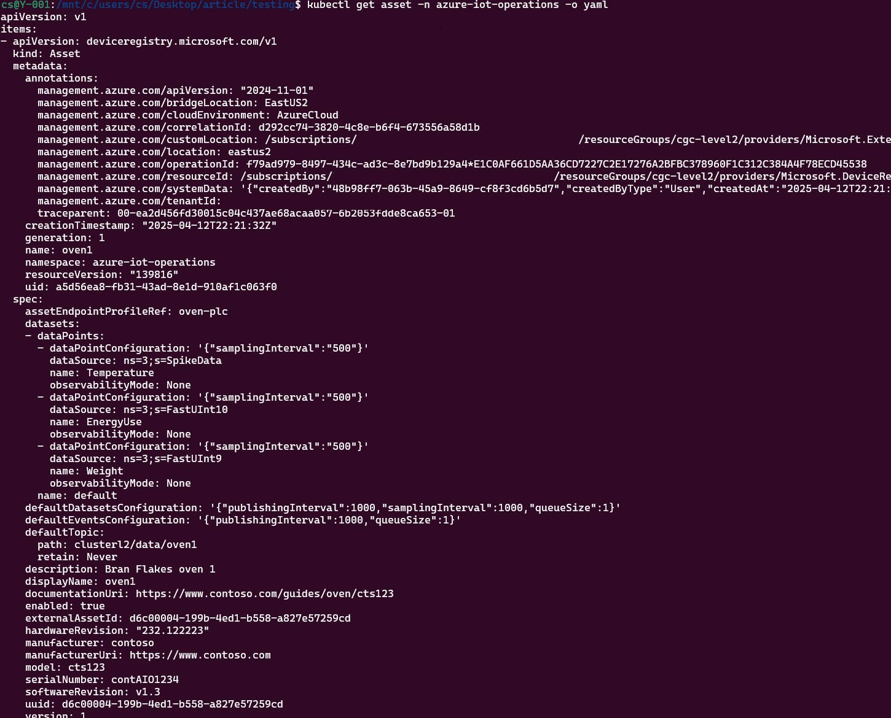

# Asset telemetry

This article explains how to use MQTT Broker and data flows to move application telemetry through the previously configured Purdue network. The process starts with an asset deployed in Purdue level2 and moves data from cluster to cluster, eventually landing in the cloud. At each cluster, a transformation adds new information to show how you can layer contextualization throughout the system. For example, an asset might send information from the Panels Creation Manufacturing Cell, but the asset itself doesn't know this context. Adding context at the cluster is a good option.

This article isn't a definitive guide or a production configuration. For core concepts, see the [Azure IoT Operations documentation](https://learn.microsoft.com/en-us/azure/iot-operations/discover-manage-assets/overview-manage-assets).

## Prerequisites

Before you start, make sure the following prerequisites are in place:

An Event Hubs namespace is created with these configurations:

- Local authentication is enabled
- The standard pricing tier is in use (other tiers can work)
- The target Event Hub is created within the namespace
- You have access to the Azure portal and rights to add users to the Azure Event Hubs Data Sender role
- Public access is enabled for networking (all networks are used, but you should limit access to selected networks)
- The Event Hub status is enabled


## Add the AIO deployments to a single site

This article focuses on techniques to set up a layered network. The examples use clusters in a single factory called site-1. For this article, the admin already created a site named site-1, scoped to the entire subscription. All clusters deployed in the same subscription are part of that site, as shown here.

1. Go to the [Azure IoT Operations](https://iotoperations.azure.com/) portal

    

    If the site isn't already created, you can find your clusters under unassigned instances.

    

1. Select site-1 to show the clusters created on level2, level3, and level4.

    

1. When the following steps say to go to the cluster, select the link with the instance name below it to show the screen for that cluster.

    

## Deploying the Sample Asset on level2

The level2 cluster will have the OPC PLC simulator deployed to it to generate the required telemetry data that will be sent up through the parent clusters eventually landing in the cloud.

1. To deploy the OPC PLC simulator for use in sending telemetry to the cloud run the following commands from the jump box.

    ```bash
    kubectl config use-context level2
        kubectl apply -f https://raw.githubusercontent.com/Azure-Samples/explore-iot-operations/main/samples/quickstarts/opc-plc-deployment.yaml
    ```

    

    > [!NOTE]
    > It is important to note that this configuration uses a self-signed application instance certificate. Don't use this configuration in a production environment. To learn more, see [Configure OPC UA certificates infrastructure for the connector for OPC UA](https://learn.microsoft.com/en-gb/azure/iot-operations/discover-manage-assets/howto-configure-opcua-certificates-infrastructure).

1. Navigate to the level2 cluster in the Azure IoT Operations portal and choose Asset endpoints

    

1. Select **Create new asset endpoint** to configure the OPC UA connector to subscribe to the data from the OPC PLC simulator.

1. To configure the OPC UA connector to subscribe to the data from the OPC UA PLC Simulator we must first create an endpoint. Select **Create new asset endpoint**.

    - Asset endpoint name: oven-plc
    - OPC UA server URL: opc.tcp://opcplc-000000:50000
    - User authentication mode: Anonymous

    

1. Select **generate** to deploy the new endpoint, wait for the notification that it is complete (top right corner of the portal).

    

    Clicking refresh will display the endpoint

    


1. Select Assets in the left menu and then "Create new asset"

    - Select asset endpoint (the one previously created)
    - Asset name: oven1
    - Default MQTT topic: clusterl2/data/oven1
    - Description: Bran Flakes oven 1
    - Documentation URL: https://www.contoso.com/guides/oven/cts123
    - Hardware version: 232.122223
    - Manufacturer: contoso
    - Manufacturer URL: https://www.contoso.com
    - Model: cts123
    - Serial Number: contAIO1234
    - Software version: v1.3
    - Delete the other Custom properties

    


1. Selecting next provides the screen that the tags will be added to. 

1. Add the following tags before selecting next by clicking the Add Tag under the drop down:

    

    - Tag Name: Temperature, Node Id: ns=3;s=SpikeData, Sampling Interval: 500, Queue size: 1
    - Tag Name: EnergyUse, Node Id: ns=3;s=FastUInt10, Sampling Interval: 500, Queue size: 1
    - Tag Name: Weight, Node Id: ns=3;s=FastUInt9, Sampling Interval: 500, Queue size: 1

    

    

1. Select Next then do not add any events for this demo. Select Next

    

1. Click Create then after it is complete selecting refresh should show the new oven1 asset in the list

    

1. After the deployment completes from the jump box using level2 context perform the following query to see the asset at the edge

    ```bash
    kubectl get asset -n azure-iot-operations -o yaml
    ```

    

## View the level2 MQTT asset telemetry

This section uses an insecure MQTT client connection and configuration to review messages. Don't use this configuration in production. It's for demonstration purposes only.

1. In the Azure portal, go to the level2 Azure IoT Operations instance.

    

1. In the left menu, select **Components** > **MQTT broker**.

    

1. Create a new MQTT broker listener for LoadBalancer.
    - Enter the name as publiclistener.
    - Leave the service name blank.

1. Enter the following for ports:
    - Port: 1883
    - Authentication: none
    - Authorization: none
    - Protocol: MQTT
    - Don't add TLS.

    

1. Create the listener. After deployment finishes, view it by running the following command on the jump box in the level2 context:

    ```bash
    kubectl config use-context level2
    
    kubectl get service publiclistener -n azure-iot-operations -o yaml
    ```

    

1. On the jump box, in the level2 context, run the following script to deploy the MQTT client pod:

    ```bash
    wget https://raw.githubusercontent.com/Azure-Samples/explore-iot-operations/main/samples/quickstarts/mqtt-client.yaml -O mqtt-client.yaml
    
    kubectl apply -f mqtt-client.yaml
    ```


1. On the jump box, use the mqttui client to inspect the level2 broker:

    ```bash
    mqttui --broker mqtt://192.168.102.10:1883
    ```

  

1. In the left pane, go to clusterl2/data/oven1.

    

## Configure level3 to listen for incoming MQTT connections

This section uses an insecure MQTT client connection and configuration to review messages. Don't use this configuration in production—it's for demonstration purposes only. Limit the listener to specific hosts and enable authentication and authorization, like mTLS.

The following section uses an insecure MQTT client connection and configuration to review the messages. It is recommended that this is not used in production and is for demonstration purposes only.

1. In the Azure portal, go to the level3 Azure IoT Operations instance.

    

1. In the left menu selection Components -> MQTT broker

    

1. Create a new MQTT broker listener for LoadBalancer:
    - Enter the name as `publiclistener`.
    - Leave the service name blank.

1. Create a new MQTT broker listener for LoadBalancer

    - Enter the name as publiclistener
    - Service name is blank

1. Enter the following for ports

    - Port: 1883
    - Authentication: none
    - Authorization: none
    - Protocol: MQTT
    - Do not add TLS

    

1. Create the listener, then view it after deployment by running the following command on the jump box against the level3 context.

    ```bash
    kubectl config use-context level3
    
    kubectl get service publiclistener -n azure-iot-operations -o yaml
    ```

    

## Configure level4 to listen for incoming MQTT connections

The following section uses an insecure MQTT client connection and configuration to review the messages. It is recommended that this is not used in production and is for demonstration purposes only. The listener should be limited to specific hosts and authentication/authorization such as mTLS enabled. 

The following section uses an insecure MQTT client connection and configuration to review the messages. it is recommended that this is not used in production and is for demonstration purposes only.

1. In the Azure portal, go to the level4 Azure IoT Operations instance.

    

1. In the menu, select **Components > MQTT broker**.

    

1. Create a new MQTT broker listener for LoadBalancer:
    - Enter the name as `publiclistener`.
    - Leave the service name blank.

1. Enter the following for ports:
    - Port: `1883`
    - Authentication: none
    - Authorization: none
    - Protocol: MQTT
    - Don't add TLS.

    

1. Create the listener. After deployment finishes, run the following command on the jump box against the level4 context:

    ```bash
    kubectl config use-context level4
    
    kubectl get service publiclistener -n azure-iot-operations -o yaml
    ```

    

## Configure level2 to transform the message and send to level3

In this section, oven1 messages get an extra piece of data that shows the current product being produced, then forwards it to level3. Because this isn't a data flow tutorial, this article uses a simplified, hard coded technique to add the product details. In production, you'd typically use a secondary stream or similar method.

1. In the Azure IoT Operations portal, go to the level2 cluster, then select **Data flow endpoints**.

    

1. Select **Custom MQTT Broker** to open the blade, then enter the details of the level3 broker (upstream).

    - Name: level3
    - Host: 192.168.103.10:1883
    - Authentication method: None

    

1. Select **Apply** and wait for the creation to finish.

1. Select **Data flows** from the left pane.

    

1. Create a new data flow to show the data flow canvas.

    

1. Select **Select Source**, choose **Asset / Oven**, then select **Apply**.

    

1. Select **Select data flow endpoint**, then select **level3** and **Proceed** to make the data flow target the public listening endpoint of the level3 cluster.

    

1. Use the MQTT topic `/l2in/data/oven1` to specify where the data lands in the level3 broker, then select **Apply**.

    

1. Select **Add transform (optional)** to open the transform choices, then select **New property**.

    

1. Enter the following details:

    - Property key: `product`
    - Property value: `flakes`
    - Description: Added flakes as product

    

1. After you select **Apply**, the flow looks like this:

    

1. Select the **Edit** option beside **Data flow enabled**, add a new pipeline name called `level2-to-level3`, make sure **Enable data flow** is checked, then select **Apply**.

    

1. Select the **save** button and wait for the deployment to finish.

    

1. On the jump box, use the `mqttui` client to inspect the level3 broker.

    ```bash
    mqttui --broker mqtt://192.168.103.10:1883
    ```

1. Go to `/l2in/data/oven1` in the left pane.

    

     At the top of the right pane, you see that the product is `flakes`.

## Configure level3 to transform the message and send to level4

In this section, oven1 messages are transformed to include an extra piece of data that shows the current line configuration is cereal production, then sent to level4. Because this isn't a data flow tutorial, this article uses a simplified, hard-coded way to add the product details. In production, you'd typically use a secondary stream.

1. In the Azure IoT Operations portal, go to the level3 cluster, then select **Data flow endpoints**.

    

1. Select **Custom MQTT Broker** to open the blade, then enter the details of the level4 broker (upstream).

    - Name: level4
    - Host: 192.168.104.10:1883
    - Authentication method: None

    

1. Select **Apply** and wait for the creation to complete

1. Go to the [Schema Gen helper](https://azure-samples.github.io/explore-iot-operations/schema-gen-helper/) to define the source schema (this level doesn't know about the other levels' assets).

    

1. On the jump box, use `mosquitto_sub` to get some sample messages, or use the example file contents that follow.

    ```bash
    mosquitto_sub --host 192.168.103.10 --port 1883 -t "/l2in/data/oven1"
    ```

    ```json
    {
        "EnergyUse": {
        "SourceTimestamp": "2025-04-05T15:55:05.991129Z",
        "Value": 212
        },
        "Temperature": {
        "SourceTimestamp": "2025-04-05T15:55:06.6915356Z",
        "Value": 98.22872507286884
        },
        "Weight": {
        "SourceTimestamp": "2025-04-05T15:55:05.9910467Z",
        "Value": 229
        },
        "product": "flakes"
    }
    ```

1. Select **JSON Schema (Draft-07)** and set all fields to be nullable.

1. Select **Generate** to review the schema.

1. Select **Download** and name the file *level2inschema.json*.

1. Select "Data flows" from the left pane

    

1. Create a new data flow to display the data flow canvas

    

1. Select **Select Source**. Note that no assets are present here because this level doesn't know about the downstream asset, so you must use **Message broker**.

    - Data flow endpoint: default
    - Topic: /l2in/data/oven1
    - Message schema: Select **Upload** and browse to the *level2inschema.json* file (there might be a slight delay while it uploads).

    

1. Select **Select data flow endpoint**, then select **level4** and proceed to make the data flow target the public listening endpoint of the level4 cluster.

    
1. Use the MQTT topic `/l3in/data/oven1` to indicate where the data lands in the level3 broker, then select **Apply**.

    

1. Click on Add transform (optional) to expose the Transform choices where New property should be selected

    

1. Enter the details:

    - Property key: `line-config`
    - Property value: `cereal`
    - Description: Line configured for cereal production.

    

1. After clicking apply the flow should look as follows

    

1. Select the **Edit** option beside **Data flow enabled** and add a new pipeline name called *level3-to-level4*. Make sure **Enable data flow** is checked, then select **Apply**.

    

1. Select the "save" button and wait for it to complete the deployment

    

1. On the jump box, use the `mqttui` client to inspect the level4 broker. It can take a few minutes for data to appear after the schema is received at the edge. The following MQTT topic on level3 shows the receipt of the schema. Once received, the command that follows shows messages coming into level4.

    ```bash
    mqttui --broker mqtt://192.168.104.10:1883
    ```

1. Go to `/l3in/data/oven1` in the left pane.

    

    At the top of the right pane, you see that the product is flakes and the line configuration is cereal.

## Configure level4 to Transform the Message and Send to Event Hub

In this section the oven1 transformed messages will have an additional piece of data added that indicates the factory number then forwards it to an Event Hubs. As this is not a Data Flow tutorial it will used a simplified "hard coded" technique to adding the product details. In production this would typically be a secondary stream etc.

1. This will not guide through the creation of the Event Hubs and assumes it is already available. 

1. Assign permissions to the Event Hub for the managed identity of the level4 cluster
    - In the Azure Portal navigate to the Azure IoT Instance for level4 and select Overview and copy the name of the extension

    

    - Copy the name of the extension as it has the same name as the system assigned managed identity

1. Go to the Event Hubs namespace > **Access control (IAM)** > **Add role assignment**.

    

1. Add a role assignment.

    - Role: Azure Event Hubs Data Sender
    - Assign access to: User, group, or service principal
    - Select Members: The managed identity of the Azure IoT Operations found above (Arc extension name)

1. In the Azure IoT Operations portal navigate to the level4 cluster then select **Data flow endpoints**.

    

1. Select Azure Event Hubs and enter the following

    - Name: event-hubs-target
    - Host: Search for the Event Hubs Namespace by name and select it
    - Authentication method: System assigned managed identity

    

1. Select **Apply** and wait for the creation to complete.

1. Go to the [Schema Gen helper](https://azure-samples.github.io/explore-iot-operations/schema-gen-helper/) to define the source schema (this level does not know about the other levels assets)

    

1. On the jump box, use mosquitto_sub to retrieve some samples of the message or use the example file contents that follow:

    ```bash
    mosquitto_sub --host 192.168.104.10 --port 1883 -t "/l3in/data/oven1"
    ```

    ```json
    {
        "EnergyUse": {
        "SourceTimestamp": "2025-04-05T16:42:50.9882087Z",
        "Value": 232
        },
        "Temperature": {
        "SourceTimestamp": "2025-04-05T16:42:51.7943136Z",
        "Value": 99.80267284282716
        },
        "Weight": {
        "SourceTimestamp": "2025-04-05T16:42:50.9881744Z",
        "Value": 272
        },
        "line-config": "cereal",
        "product": "flakes"
    }
    ```

1. Select JSON Schema (Draft-07) schema and set all fields to be nullable.

1. Select **Generate** to review the schema.

1. Select **Download** and name it `level3inschema.json`.

1. Select **Data flows** from the left pane

    

1. Create a new data flow to display the data flow canvas

    

1. Click on Select Source and note that no Assets are present here as they do not know about the "downstream asset", so "Message broker" must be used.

    - Data flow endpoint: default
    - Topic: /l3in/data/oven1
    - Message Schema: Click upload and browse to the level3inschema.json file (slight delay while it uploads)

    

1. Select on Select data flow endpoint, then select event-hubs-target target created in the previous step.

    

1. The Topic to enter when prompted is the name of the Event Hubs (not namespace), then select **Apply**.

    

1. Select  **Add transform (optional)** to expose the Transform choices where New property should be selected.

    

1. Enter the details.

    - Property key: factory-code
    - Property value: 1032
    - Description: The id of the factory

    

1. After selecting **apply** the flow should look as follows.

    

1. Select the Edit option beside Data flow enabled and add a new pipeline name called level4-to-cloud. 

    Ensure Enable data flow is checked and select **Apply**.

    

1. Select the **Save** button and wait for deployment to complete.

    

1. Review the stats in the Event Hub (destinationeh) to see the messages are arriving (Incoming Messages (Sum), cgc-eh-cluster).

    

1. See the details of the messages that are arriving by selecting **Data Explorer** and then **View Events**.

    

1. Selecting one of the messages in the list displays the information received in the Event Hub

    
