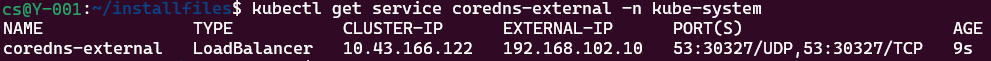

# Configure the Infrastructure (Core DNS and Envoy Proxy)

In this article, you set up the Envoy Proxy on Level 4 and Level 3 and the Core DNS on Level 3 and Level 2 allow the Arc enablement of the K3s clusters that are on Level 2 and Level 3 that do not have direct access to the internet. 

- Level 4 has an Envoy Proxy deployed but uses the Enterprise DNS servers to resolve to internet addresses
- Level 3 has an Envoy Proxy deployed but uses the locally hosted Core DNS servers to resolve the internet address to the Level 4 IP
- Level 2 has an Envoy Proxy deployed but uses the locally hosted Core DNS servers to resolve the internet address to the Level 3 IP
- All traffic moving through the Envoy Proxies are on port 443 and port 8084.

The Envoy Proxies leverage an allow list and RBAC to restrict access and the URI that can be accessed. 

## Prerequisites

- A router or advanced switch that supports virtual networks and network rules (this can also be done with Azure networks and rules not covered here). The following configuration is assumed to have been previously setup.
  - Virtual Networks: 
    - Level 4: 192.168.104.0/24
    - Level 3: 192.168.103.0/24
    - Level 2: 192.168.102.0/24
    - level 1: 192.168.101.0/24
    - Default: 192.168.0.0/24
  - Network rules:
    - Level 4: allowed internet communication, default, and level 3 as well as any other within level 4
    - Level 3: allowed communication with level 4, default, and level 2 as well as any other within level 3
    - Level 2: allowed communication with level 3, default, and level 1 as well as any other within level 2
    - Level 1: allowed communication with level 2 and default as well as any other within level 1
    - Default: allowed communications with any level and internet
- The following Small Form Factor Machines ("SFFM") or similar have been deployed with the following configurations
  - Jumpbox
    - Operating System: Ubuntu 22.04 LTS updated and upgraded to latest
    - Virtual Network: Default
    - Static IP Address: 192.168.0.50
    - Host Name: jumpbox
    - Installed Software: kubectl, apt-transport-https ca-certificates curl gnupg, azure CLI, mosquitto-clients, nano, wget, curl, docker cli
    - Noted Configuration
      - For demonstration simplicity ufw was disabled
      - Configuration has been done to allow connection to each of the kubernetes clusters (and set to ~/.kube/config environment)
        - names of context are level4, level3, and level2
  - Level 4
    - Operating System: Ubuntu 22.04 LTS updated and upgraded to latest
    - Virtual Network: Level 4
    - Static IP Address: 192.168.104.10
    - Host Name: level4
    - Installed Software: nano, wget, curl, k3s, k9s (recommended), helm (recommended), mqttui 
    - ssh server is enabled
    - Noted Configuration: 
      - for demonstration simplicity ufw was disabled
      - kubectl config file is set to ~/.kube/config environment and rancher k3s.yaml has been moved there
  - Level 3
    - Operating System: Ubuntu 22.04 LTS updated and upgraded to latest
    - Virtual Network: Level 3
    - Static IP Address: 192.168.103.10
    - Host Name: level3
    - Installed Software: nano, wget, curl, k3s (air gapped install with bootstrapping images added), k9s (recommended), helm (recommended), mqttui 
    - ssh server is enabled
    - Noted Configuration: 
      - for demonstration simplicity ufw was disabled
      - kubectl config file is set to ~/.kube/config environment and rancher k3s.yaml has been moved there
  - Level 2
    - Operating System: Ubuntu 22.04 LTS updated and upgraded to latest
    - Virtual Network: Level 2
    - Static IP Address: 192.168.102.10
    - Host Name: level2
    - Installed Software: nano, wget, curl, k3s (air gapped install with bootstrapping images added), k9s (recommended), helm (recommended), mqttui 
    - ssh server is enabled
    - Noted Configuration: 
      - for demonstration simplicity ufw was disabled
      - kubectl config file is set to ~/.kube/config environment and rancher k3s.yaml has been moved there

## Preparing the Jump Box

To reduce the number of URI that need to be whitelisted in this configuration the images will be downloaded to the Jump box and then moved onto the various machines to import into the K3s local image cache. In an ideal scenario the environment will have a private image registry that can these can be loaded into instead (requires registry credentials for pulling to be setup as well).

1. Download the Envoy v1.33.0 image onto the jump box.

    ```bash
    # assuming the directory to store files is ~/installfiles
    
    docker pull envoyproxy/envoy:v1.33.0
    docker save -o ./envoy_v1.33.0.tar envoyproxy/envoy:v1.33.0
    chown ${USER} ./envoy_v1.33.0.tar && chmod 777 ./envoy_v1.33.0.tar
    ```


1. Prepare the configuration files for Envoy Proxy for level 4.

    ```bash
    # Setup Envoy Proxy for Level 4
    
    # Create a backup of the original configuration file and replace the "place holder values"
    cp ./yaml/level4-envoy-config.yaml ./level4-envoy-config.yaml
    
    # If using a different kubernetes network and CIDR update here
    sed -i 's/kubenet/10.42.0.0/g' ./level4-envoy-config.yaml
    sed -i 's/kubecidr/16/g' ./level4-envoy-config.yaml
    
    # If using a different level 4 network setup for the environment update accordingly
    sed -i 's/currentnet/192.168.104.0/g' ./level4-envoy-config.yaml
    sed -i 's/currentcidr/24/g' ./level4-envoy-config.yaml
    
    # If using a different level 3 network setup for the environment update accordingly
    sed -i 's/childnet/192.168.103.0/g' ./level4-envoy-config.yaml
    sed -i 's/childcidr/24/g' ./level4-envoy-config.yaml
    ```

1. Prepare the configuration files for Envoy Proxy and Core DNS on level 3


1. Prepare the configuration file Core DNS on level 2

    ```bash
    # Setup Core DNS for Level 2
    
    # Create a backup of the original configuration file and replace the "place holder values"
    cp ./yaml/level2-coredns-config.yaml ./level2-coredns-config.yaml
    
    # If using a different kubernetes network and CIDR update here
    sed -i 's/parentip/192.168.103.10/g' ./level2-coredns-config.yaml
    ```

## Deploy to Level 4

In this level the enterprise name servers (or public) are used to get "the real" resolution so no special configuration of the name servers are required. The Envoy Proxy is the only part configured at this level. 

This proxying configuration is focused on enabling the control plane aspects, while the data plane traffic typically targets local endpoints or upstream clusters it does not fall into the "proxied traffic". Setting up the Envoy Proxy on this level allows the level3 server to access the required internet services (URI) while leveraging the proxies RBAC capabilities to restrict access to Kubernetes networks and level3/level4 network hosts. These can be loosened or tightened depending on the implementation specific needs.

Only port 443 and 8084 listeners will be setup as the control plane traffic of AIO will operate over these, not starting the level 80 http listener is a choice to improve the security posture. 

While the levels that do not have internet access must use the image for envoy/envoy:v1.33.0 previously downloaded to the jump box, this level will pull from the source as it has internet access.

### Understanding the Envoy Configuration

```bash
# Review the envoy configuration file 
cat ./level4-envoy-config.yaml
```

The admin sight is setup to listen on port 10000.


There are 3 clusters configured, each are targets of the traffic that is split. In this configuration they use the machines routing etc. to operate, but could be adjusted to point to an enterprise or upstream proxy. The split of traffic into arc-connect-cluster (used for Arc to enable Arc enabled kubernetes), https-primary-cluster (used for packets that should not be in inspected by terminating proxies), and https-other-cluster (for all traffic that can be inspected by terminating proxies).


Two listeners have been setup one one that can listen (via the service) on port 443 and the other on port 8084 (Arc Connect). The 443 traffic is later split into inspectable or not inspectable traffic. The list of server names are the ones that will be routed by the specified filter chain.


Only certain network ranges and or machines will be allowed to use the Envoy Proxy. Kubernetes network (10.42.0.0/16 in our case), level 4 network (192.168.104.0/24), and level 3 network (192.168.103.0/24).


There a service setup that fronts this that has been setup as a load balanced endpoint.


From the jump box change to the level4 context and deploy the Envoy Proxy with configuration to it.

```bash
# Set the context
kubectl config use-context level4

# Deploy the config that was just created
kubectl apply -f ./level4-envoy-config.yaml
```


Reviewing the pods will show a new pod from envoy pod running on the node.


## Deploy to Level 3

In this level the there is no internet access so it is important to first install the envoy/envoy:v1.33.0 image on the level3 machine as it will not have internet access to pull it. Following that we configure name resolution to use CoreDNS resolving a list of known URI to the upstream (parent) envoy proxy service. 

This proxying configuration is focused on enabling the control plane aspects, while the data plane traffic typically targets local endpoints or upstream clusters it does not fall into the "proxied traffic". Setting up the Envoy Proxy on this level allows the level2 server to access the required internet services (URI) while leveraging the proxies RBAC capabilities to restrict access to Kubernetes networks and level2/level3 network hosts. These can be loosened or tightened depending on the implementation specific needs.

Only port 443 and 8084 listeners will be setup as the control plane traffic of AIO will operate over these, not starting the level 80 http listener is a choice to improve the security posture. 

Copy the previously downloaded envoy image from the jump box into the ~/ directory on the level3 machine, then upload it to the k3s image store (not using a private repository but that can be used if desired)

```bash
# On the jump box
scp ./envoy_v1.33.0.tar ubuntu@192.168.103.10:~/

# ssh to the machine 
ssh ubuntu@192.168.103.10

sudo k3s ctr images import ./envoy_v1.33.0.tar

exit
```

### Understanding the Envoy Configuration

```bash
# Review the envoy configuration file 
cat ./level3-envoy-config.yaml
```

The admin sight is setup to listen on port 10000


There are 3 clusters configured, which are targets of the traffic that is split. In this configuration they use the machines routing etc. to operate, but could be adjusted to point to an enterprise or upstream proxy. The split of traffic into arc-connect-cluster (used for Arc to enable Arc enabled kubernetes), https-primary-cluster (used for packets that should not be in inspected by terminating proxies), and https-other-cluster (for all traffic that can be inspected by terminating proxies). The DNS resolution portion is important as it indicates the DNS server that should have the IP Addresses resolved (in our case it is CoreDNS on the local node) .


Two listeners have been setup one one that can listen (via the service) on port 443 and the other on port 8084 (Arc Connect). The 443 traffic is later split into inspectable or not inspectable traffic. The list of server names are the ones that will be routed by the specified filter chain.


Only certain network ranges and or machines will be allowed to use the Envoy Proxy. Kubernetes network (10.42.0.0/16 in our case),  level 3 network (192.168.103.0/24), and level 2 network (192.168.102.0/24).


There a service setup that fronts this that has been setup as a load balanced endpoint.


From the jump box change to the level3 context and deploy the Envoy Proxy with configuration to it

```bash
# Set the context
kubectl config use-context level3

# Deploy the config that was just created
kubectl apply -f ./level3-envoy-config.yaml
```

Reviewing the pods will show a new pod from envoy pod running on the node.


Review the Core DNS config map.

```bash
cat level3-coredns-config.yaml
```

This is a Kubernetes ConfigMap that will be applied to the kube-system namespace and called coredns-custom


Domain requests for domain resolution on port 53 that are not wildcard domains will resolve the specific host to the parent address (192.168.104.10).


The wildcard domains are almost the same with a clause to rewrite the names to not include the wildcard (*.)


Deploy the CoreDNS ConfigMap that was just created and the Load Balancer service to allow CoreDNS to be accessed outside the cluster.

```bash
# Set context of the kubectl CLI to use the previously configured level3 context (ensure it targets the proper)
kubectl config use-context level3

# Apply the Core DNS configuration file that was prepared on the parent node
kubectl apply -f ./level3-coredns-config.yaml

# Expose the CoreDNS for external to use
kubectl apply -f ./yaml/dns-expose-external.yaml

# Restart the CoreDNS server so changes take effect
kubectl rollout restart -n kube-system deployment/coredns

# See that the external DNS is associated with service
kubectl get service coredns-external -n kube-system
```


Setup the host machines resolver to use the CoreDNS service that was exposed. This will point to the services external IP address, which in this tutorial is the IP Address of the level3 machine (192.168.103.10). This requires establishing an ssh session to the machine to complete

```bash
ssh ubuntu@192.168.103.10

echo "DNS=127.0.0.1" | sudo tee -a sudo /etc/systemd/resolved.conf && echo "DNSStubListener=no" | sudo tee -a sudo /etc/systemd/resolved.conf

# Restart the resolver service to make it take effect
sudo systemctl restart systemd-resolved
```

Test the name service. For ease of testing the example.com and *.example.com domains were added to the name resolution and proxy allow list.

```bash
# Perform in the ssh session to the remote machine

# Query one of the IPv4 addresses found in the CoreDNS configuration file
dig example.com
```


The important items that indicate it is working properly are:
- The server handling the query is 192.168.103.10 (level3's IP address)
- The answer had the parents IP address (level4's IP address) 192.168.104.10

Test the ability to query the internet through the upstream envoy proxy.

```bash
curl -v https://www.example.com
```


Exit the ssh session to the jump box.

```bash
exit
```

## Deploy to Level 2

In this level, it will not be proxying and traffic so only name resolution must be configured. 

Review the Core DNS config map:

```bash
cat level2-coredns-config.yaml
```

This is a Kubernetes ConfigMap that will be applied to the kube-system namespace and called coredns-custom.


Domain requests for domain resolution on port 53 that are not wildcard domains will resolve the specific host to the parent address (192.168.103.10)


The wildcard domains are almost the same with a clause to rewrite the names to not include the wildcard (*.)


Deploy the CoreDNS ConfigMap that was just created and the Load Balancer service to allow CoreDNS to be accessed outside the cluster

```bash
# Set context of the kubectl CLI to use the previously configured level2 context (ensure it targets the proper)
kubectl config use-context level2

# Apply the Core DNS configuration file that was prepared on the parent node
kubectl apply -f ./level2-coredns-config.yaml

# Expose the CoreDNS for external to use
kubectl apply -f ./yaml/dns-expose-external.yaml

# Restart the CoreDNS server so changes take effect
kubectl rollout restart -n kube-system deployment/coredns

# See that the external DNS is associated with service
kubectl get service coredns-external -n kube-system
```




Setup the host machines resolver to use the CoreDNS service that was exposed. This will point to the services external IP address, which in this tutorial is the IP Address of the level2 machine (192.168.102.10). This requires establishing an ssh session to the machine to complete.

```bash
ssh ubuntu@192.168.102.10

echo "DNS=127.0.0.1" | sudo tee -a sudo /etc/systemd/resolved.conf && echo "DNSStubListener=no" | sudo tee -a sudo /etc/systemd/resolved.conf

# Restart the resolver service to make it take effect
sudo systemctl restart systemd-resolved
```

Test the name service. For ease of testing the example.com and *.example.com domains were added to the name resolution and proxy allow list.

```bash
# Perform in the ssh session to the remote machine

# Query one of the IPv4 addresses found in the CoreDNS configuration file
dig example.com
```


The important items that indicate it is working properly are:
- The server handling the query is 192.168.102.10 (level2's IP address)
- The answer had the parents IP address (level3s IP address) 192.168.103.10

Test the ability to query the internet through the upstream envoy proxy.

```bash
curl -v https://www.example.com
```


Exit the ssh session to the jump box.

```bash
exit
```

## Troubleshooting

While the www.example.com and example.com Core DNS and Envoy configurations can and should be removed, they are used here to demonstrate and troubleshoot the configuration. If you need to identify a problem or test the setup, follow these steps from the jump box:

1. Get and record the external or load balanced IP address of the Envoy services on level4 and level3:

    ```bash
    # Change context to point at level4
    kubectl config use-context level4

    # Get the IP address of the Envoy service (EXTERNAL-IP)
    kubectl get service envoy-lnm-demo-service

    # Change context to point at level3
    kubectl config use-context level3

    # Get the IP address of the Envoy service (EXTERNAL-IP)
    kubectl get service envoy-lnm-demo-service
    ```

    

1. Establish an SSH session into level2 and check name resolution to ensure it points to the EXTERNAL-IP of level3:

    ```bash
    # Establish the SSH session
    ssh ubuntu@192.168.102.10

    # Check the name resolution to ensure the example.com A record points to the EXTERNAL-IP of level3
    dig www.example.com
    ```

    

1. In a separate terminal, establish an SSH session with level3 to monitor the Envoy logs using tail:

    ```bash
    # Establish the SSH session
    ssh ubuntu@192.168.103.10

    # Get the first pod (as we only have an instance count of 1) to dump the logs
    kubectl logs $(kubectl get pods -l app=envoy-lnm-demo -o jsonpath='{.items[0].metadata.name}') -f

    # For ease, press <ENTER> several times to create space, making it easy to see new entries
    ```

    

1. Using the level2 SSH session, execute the curl command to query www.example.com:

    ```bash
    # If working, the payload should be returned with an HTTP status of 2XX (e.g., 200)
    curl -v https://www.example.com
    ```

    

1. If a 2XX (200) success code is not returned or it stops at the handshake/connection, check to see if the level3 logs have the request. If they do, level2 is configured correctly (the request will appear in the log output in the other session):

    

1. If the entry exists, follow the same steps as previously defined for level3 to level4. A similar entry should be seen in level4 logs as follows:

    

## Next Steps

1. Learn how to Arc enable the K3s clusters in [Arc enable the K3s clusters](./arc-enable-clusters.md).
1. Learn how to deploy Azure IoT Operations to the clusters in [Deploy Azure IoT Operations](./deploy-aio.md).
1. Learn how to flow asset telemetry through the deployments into Azure Event Hubs in [Flow asset telemetry](./asset-telemetry.md).

