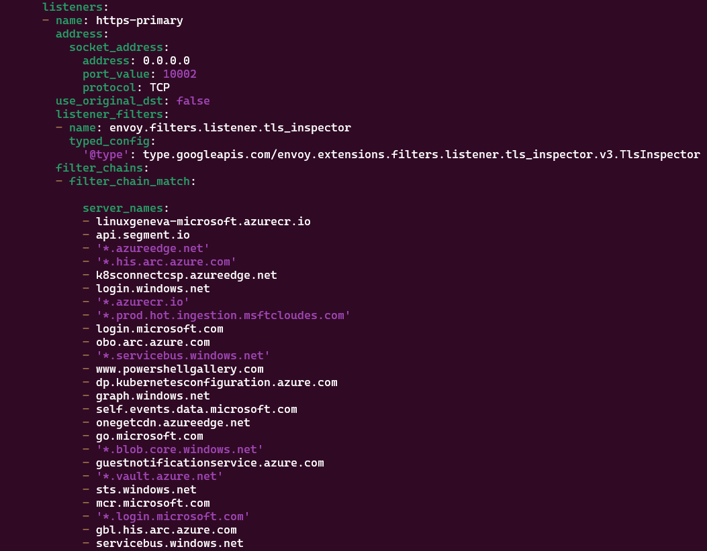

# Configure the infrastructure (Core DNS and Envoy Proxy)

This article explains how to set up Envoy Proxy on Level 4 and Level 3, and Core DNS on Level 3 and Level 2. This setup lets you use Arc for K3s clusters on Level 2 and Level 3 that don't have direct internet access.

- Level 4 has an Envoy Proxy deployed and uses Enterprise DNS servers to resolve internet addresses
- Level 3 has an Envoy Proxy deployed and uses locally hosted Core DNS servers to resolve internet addresses to the Level 4 IP
- Level 2 has Envoy Proxy deployed and uses locally hosted Core DNS servers to resolve internet addresses to the Level 3 IP
- All traffic moving through Envoy Proxy uses port 443 and port 8084.

The Envoy Proxy uses an allow list and RBAC to restrict access and control which URIs can be accessed. 

## Prerequisites

- A router or advanced switch that supports virtual networks and network rules (this can also be done with Azure networks and rules not covered here). The following configuration is assumed to have been previously setup. If you use different IP addresses/ranges in your environment, you'll need to make corresponding adaptations to the instructions throughout this article.
  - Virtual Networks: 
    - Level 4: 192.168.104.0/24
    - Level 3: 192.168.103.0/24
    - Level 2: 192.168.102.0/24
    - Level 1: 192.168.101.0/24
    - Default: 192.168.0.0/24
  - Network rules:
    - Level 4: allows internet communication, default, and Level 3, as well as any other device within Level 4
    - Level 3: allows communication with Level 4, default, and Level 2, as well as any other device within Level 3
    - Level 2: allows communication with Level 3, default, and Level 1, as well as any other device within Level 2
    - Level 1: allows communication with Level 2 and default, as well as any other device within Level 1
    - Default: allows communication with any level and internet
- Physical devices or virtual machines have been deployed with the following configurations
  - Jump box
    - Operating system: Ubuntu 22.04 LTS, updated and upgraded to the latest version
    - Virtual network: Default
    - Static IP address: 192.168.0.50
    - Host name: jumpbox
    - Installed software: kubectl, apt-transport-https, ca-certificates, curl, gnupg, Azure CLI, mosquitto-clients, nano, wget, curl, docker CLI
    - Noted configuration
      - For demonstration simplicity, ufw is disabled
      - The configuration lets you connect to each Kubernetes cluster (set to the ~/.kube/config environment)
        - Context names are level4, level3, and level2
  - Level 4
    - Operating system: Ubuntu 22.04 LTS, updated and upgraded to the latest version
    - Virtual network: Level 4
    - Static IP address: 192.168.104.10
    - Host name: level4
    - Installed software: nano, wget, curl, k3s, k9s (recommended), helm (recommended), mqttui
    - SSH server is enabled
    - Noted configuration:
      - For demonstration simplicity, ufw is disabled
      - The kubectl config file is set to the ~/.kube/config environment, and rancher k3s.yaml is moved there
  - Level 3
    - Operating system: Ubuntu 22.04 LTS, updated and upgraded to the latest version
    - Virtual network: Level 3
    - Static IP address: 192.168.103.10
    - Host name: level3
    - Installed software: nano, wget, curl, k3s (air-gapped install with bootstrapping images added), k9s (recommended), helm (recommended), mqttui
    - SSH server is enabled
    - Noted configuration:
      - For demonstration simplicity, ufw is disabled
      - The kubectl config file is set to the ~/.kube/config environment, and rancher k3s.yaml is moved there
  - Level 2
    - Operating system: Ubuntu 22.04 LTS, updated and upgraded to the latest version
    - Virtual network: Level 2
    - Static IP address: 192.168.102.10
    - Host name: level2
    - Installed software: nano, wget, curl, k3s (air gapped install with bootstrapping images added), k9s (recommended), helm (recommended), mqttui
    - SSH server is enabled
    - Noted configuration:
      - For demonstration simplicity, ufw is disabled
      - The kubectl config file is set to the ~/.kube/config environment, and rancher k3s.yaml is moved there

## Preparing the jump box

To reduce the number of URIs that you need to allowlist in this configuration, download the images to the jump box, then move them to the different machines to import into the K3s local image cache. This approach is used for simplicity; you might also consider using a private image registry for your environment and load the images there instead.

1. Download the Envoy v1.33.0 image to the jump box.

    ```bash
    docker pull envoyproxy/envoy:v1.33.0
    docker save -o ./envoy_v1.33.0.tar envoyproxy/envoy:v1.33.0
    chown ${USER} ./envoy_v1.33.0.tar && chmod 777 ./envoy_v1.33.0.tar
    ```

1. Prepare the configuration files for Envoy Proxy on level 4.

    ```bash
    # Set up Envoy Proxy for level 4
    
    # Create a backup of the original configuration file and replace the placeholder values
    cp ./yaml/level4-envoy-config.yaml ./level4-envoy-config.yaml
    
    # If you use a different Kubernetes network and CIDR, update here
    sed -i 's/kubenet/10.42.0.0/g' ./level4-envoy-config.yaml
    sed -i 's/kubecidr/16/g' ./level4-envoy-config.yaml
    
    # If you use a different level 4 network setup for the environment, update accordingly
    sed -i 's/currentnet/192.168.104.0/g' ./level4-envoy-config.yaml
    sed -i 's/currentcidr/24/g' ./level4-envoy-config.yaml
    
    # If you use a different level 3 network setup for the environment, update accordingly
    sed -i 's/childnet/192.168.103.0/g' ./level4-envoy-config.yaml
    sed -i 's/childcidr/24/g' ./level4-envoy-config.yaml
    ```

1. Prepare the configuration files for Envoy Proxy and CoreDNS on level 3.

    ```bash
    # Setup Core DNS for Level 3

    # Create a backup of the original configuration file and replace the "place holder values"
    cp ./yaml/level3-coredns-config.yaml ./level3-coredns-config.yaml

    # If using a different kubernetes network and CIDR update here
    sed -i 's/parentip/192.168.104.10/g' ./level3-coredns-config.yaml

    # Setup Envoy Proxy for Level 3

    # Create a backup of the original configuration file and replace the "place holder values"
    cp ./yaml/level3-envoy-config.yaml ./level3-envoy-config.yaml

    # If using a different kubernetes network and CIDR update here
    sed -i 's/kubenet/10.42.0.0/g' ./level3-envoy-config.yaml
    sed -i 's/kubecidr/16/g' ./level3-envoy-config.yaml

    # If using a different level 3 network setup for the environment update accordingly
    sed -i 's/currentnet/192.168.103.0/g' ./level3-envoy-config.yaml
    sed -i 's/currentcidr/24/g' ./level3-envoy-config.yaml

    # If using a different level 2 network setup for the environment update accordingly
    sed -i 's/childnet/192.168.102.0/g' ./level3-envoy-config.yaml
    sed -i 's/childcidr/24/g' ./level3-envoy-config.yaml

    # Set the IP of the current Core DNS load balanced IP and the parent Envoy Load Balanced IP
    sed -i 's/parentip/192.168.104.10/g' ./level3-envoy-config.yaml
    sed -i 's/currentip/192.168.103.0/g' ./level3-envoy-config.yaml
    ```

1. Prepare the configuration file for CoreDNS on level 2.

    ```bash
    # Set up CoreDNS for level 2
    
    # Create a backup of the original configuration file and replace the "place holder values"
    cp ./yaml/level2-coredns-config.yaml ./level2-coredns-config.yaml
    
    # If using a different kubernetes network and CIDR update here
    sed -i 's/parentip/192.168.103.10/g' ./level2-coredns-config.yaml
    ```

## Deploy to Level 4

At this level, enterprise or public name servers provide DNS resolution, so you don't need to configure name servers. Only the Envoy Proxy is configured at this level. 

This proxy configuration lets control plane traffic through. Data plane traffic usually targets local endpoints or upstream clusters, so it isn't proxied. Setting up the Envoy Proxy at this level lets the level 3 server use required internet services (URI) and uses the proxy's RBAC capabilities to restrict access to Kubernetes networks and level3 or level4 network hosts. Adjust these restrictions based on your implementation needs.

Only port 443 and 8084 listeners are set up because AIO control plane traffic uses these ports. Not starting the port 80 HTTP listener improves security.

Levels without internet access use the previously downloaded envoy/envoy:v1.33.0 image on the jump box. This level pulls the image from the source because it has internet access.

### Understanding the Envoy configuration

```bash
# Review the envoy configuration file 
cat ./level4-envoy-config.yaml
```

The admin site listens on port 10000.


Three clusters are configured, and each is a target for split traffic. In this configuration, they use the machine's routing to operate, but you can adjust them to point to an enterprise or upstream proxy. Traffic splits into arc-connect-cluster (for Arc-enabled Kubernetes), https-primary-cluster (for packets that shouldn't be inspected by terminating proxies), and https-other-cluster (for traffic that can be inspected by terminating proxies).


Two listeners are set up: one listens on port 443, and the other on port 8084 (Arc Connect). The 443 traffic is later split into inspectable or non-inspectable traffic. The server names in the list are routed by the specified filter chain.


Only certain network ranges or machines can use the Envoy Proxy: the Kubernetes network (10.42.0.0/16), the level 4 network (192.168.104.0/24), and the level 3 network (192.168.103.0/24).


A service fronts this setup as a load balanced endpoint.


From the jump box, switch to the level4 context and deploy the Envoy Proxy with its configuration.

```bash
# Set the context
kubectl config use-context level4

# Deploy the configuration you just created
kubectl apply -f ./level4-envoy-config.yaml
```


When you review the pods, you see a new Envoy pod running on the node.


## Deploy to Level 3

At this level, there's no internet access, so first install the envoy/envoy:v1.33.0 image on the level3 machine because it can't pull the image directly. Then, set up name resolution to use CoreDNS, which resolves a list of known URIs to the upstream (parent) Envoy proxy service.

This proxy configuration enables control plane traffic. Data plane traffic usually targets local endpoints or upstream clusters, so it isn't considered proxied traffic. Setting up Envoy Proxy at this level lets the level2 server use required internet services (URIs) and leverages the proxy's RBAC capabilities to restrict access to Kubernetes networks and level2 or level3 network hosts. You can adjust these restrictions based on your implementation needs.

Only port 443 and 8084 listeners will be setup as the control plane traffic of AIO will operate over these, not starting the level 80 http listener is a choice to improve the security posture. 

Copy the previously downloaded Envoy image from the jump box to the ~/ directory on the level3 machine, then upload it to the k3s image store. You can use a private repository if you want.

```bash
# On the jump box
scp ./envoy_v1.33.0.tar ubuntu@192.168.103.10:~/

# ssh to the machine 
ssh ubuntu@192.168.103.10

sudo k3s ctr images import ./envoy_v1.33.0.tar

exit
```

### Understanding the Envoy Configuration

```bash
# Review the envoy configuration file 
cat ./level3-envoy-config.yaml
```

The admin site is set up to listen on port 10000.


Three clusters are configured as traffic targets. In this setup, they use the machine's routing to operate, but you can adjust them to point to an enterprise or upstream proxy. Traffic splits into arc-connect-cluster (for Arc-enabled Kubernetes), https-primary-cluster (for packets that shouldn't be inspected by terminating proxies), and https-other-cluster (for all traffic that can be inspected by terminating proxies). The DNS resolution section specifies the DNS server for resolving IP addresses, which is CoreDNS on the local node.


Two listeners are set up: one listens on port 443 and the other on port 8084 (Arc Connect). The 443 traffic is later split into inspectable or non-inspectable traffic. The server names in the list are routed by the specified filter chain.



Only certain network ranges or machines can use the Envoy Proxy: the Kubernetes network (10.42.0.0/16), level 3 network (192.168.103.0/24), and level 2 network (192.168.102.0/24).


A service is set up in front of this as a load-balanced endpoint.


From the jump box, switch to the level3 context and deploy the Envoy Proxy with its configuration.

```bash
# Set the context
kubectl config use-context level3

# Deploy the config that was just created
kubectl apply -f ./level3-envoy-config.yaml
```

When you review the pods, you see a new Envoy pod running on the node.


Review the CoreDNS config map.

```bash
cat level3-coredns-config.yaml
```

This Kubernetes ConfigMap is applied to the kube-system namespace and is called coredns-custom.


Domain requests for resolution on port 53 that aren't wildcard domains resolve the specific host to the parent address (192.168.104.10).


Wildcard domains use a similar configuration, with a clause to rewrite names so they don't include the wildcard (*.).


Deploy the CoreDNS ConfigMap you just created and the load balancer service to let CoreDNS be accessed outside the cluster.

```bash
# Set context of the kubectl CLI to use the previously configured level3 context (ensure it targets the proper)
kubectl config use-context level3

# Apply the Core DNS configuration file that was prepared on the parent node
kubectl apply -f ./level3-coredns-config.yaml

# Expose CoreDNS for external use
kubectl apply -f ./yaml/dns-expose-external.yaml

# Restart the CoreDNS server so changes take effect
kubectl rollout restart -n kube-system deployment/coredns

# Check that the external DNS is associated with the service
kubectl get service coredns-external -n kube-system
```


Set up the host machine's resolver to use the CoreDNS service you exposed. This points to the service's external IP address, which in this tutorial is the IP address of the level3 machine (192.168.103.10). You need to establish an SSH session to the machine to complete this step.

```bash
ssh ubuntu@192.168.103.10

echo "DNS=127.0.0.1" | sudo tee -a /etc/systemd/resolved.conf && echo "DNSStubListener=no" | sudo tee -a /etc/systemd/resolved.conf

# Restart the resolver service to apply the changes
sudo systemctl restart systemd-resolved
```

Test the name service. For easier testing, the example.com and *.example.com domains are added to the name resolution and proxy allow list.

```bash
# Run this command in the SSH session to the remote machine

# Query one of the IPv4 addresses in the CoreDNS configuration file
dig example.com
```


The important items that show it's working properly are:
- The server handling the query is 192.168.103.10 (level3's IP address).
- The answer has the parent IP address (level4's IP address) 192.168.104.10.

Test querying the internet through the upstream Envoy proxy.

```bash
curl -v https://www.example.com
```


Exit the SSH session to the jump box.

```bash
exit
```

## Deploy to Level 2

In this level, you don't proxy any traffic, so only name resolution needs to be set up.

Review the CoreDNS ConfigMap:

```bash
cat level2-coredns-config.yaml
```

This Kubernetes ConfigMap is applied to the kube-system namespace and named coredns-custom.


Domain requests for non-wildcard domains on port 53 resolve the specific host to the parent address (192.168.103.10).


The wildcard domains are almost the same with a clause to rewrite the names to not include the wildcard (*.)


Deploy the CoreDNS ConfigMap you just created and the load balancer service to let CoreDNS be used outside the cluster.

```bash
# Set the kubectl CLI to use the previously configured level2 context
kubectl config use-context level2

# Apply the CoreDNS configuration file you prepared on the parent node
kubectl apply -f ./level2-coredns-config.yaml

# Expose the CoreDNS for external to use
kubectl apply -f ./yaml/dns-expose-external.yaml

# Restart the CoreDNS server so changes take effect
kubectl rollout restart -n kube-system deployment/coredns

# See that the external DNS is associated with service
kubectl get service coredns-external -n kube-system
```


Set up the host machine's resolver to use the CoreDNS service you exposed. This points to the service's external IP address, which in this tutorial is the IP address of the level2 machine (192.168.102.10). To do this, establish an SSH session to the machine.

```bash
ssh ubuntu@192.168.102.10

echo "DNS=127.0.0.1" | sudo tee -a sudo /etc/systemd/resolved.conf && echo "DNSStubListener=no" | sudo tee -a sudo /etc/systemd/resolved.conf

# Restart the resolver service to make it take effect
sudo systemctl restart systemd-resolved
```

Test the name service. For ease of testing the example.com and *.example.com domains were added to the name resolution and proxy allow list.

```bash
# Perform in the ssh session to the remote machine

# Query one of the IPv4 addresses found in the CoreDNS configuration file
dig example.com
```


The important items that show it's working properly are:
- The server handling the query is 192.168.102.10 (the level2 IP address).
- The answer has the parent IP address (the level3 IP address), 192.168.103.10.

Test querying the internet through the upstream Envoy proxy.

```bash
curl -v https://www.example.com
```


Exit the SSH session to the jump box.

```bash
exit
```

## Troubleshooting

Remove the `www.example.com` and `example.com` Core DNS and Envoy configurations if you don't need them. They're used here to demonstrate and troubleshoot the configuration. To identify a problem or test the setup, follow these steps from the jump box:

1. Get and record the external or load-balanced IP address of the Envoy services on level4 and level3.

    ```bash
    # Change the context to level4
    kubectl config use-context level4

    # Get the IP address of the Envoy service (EXTERNAL-IP)
    kubectl get service envoy-lnm-demo-service

    # Change the context to level3.
    kubectl config use-context level3

    # Get the IP address of the Envoy service (EXTERNAL-IP)
    kubectl get service envoy-lnm-demo-service
    ```

    

1. Establish an SSH session to level2 and check name resolution to make sure it points to the EXTERNAL-IP of level3.

    ```bash
    # Establish the SSH session
    ssh ubuntu@192.168.102.10

    # Check name resolution to make sure the example.com A record points to the EXTERNAL-IP of level3.
    dig www.example.com
    ```

    

1. In a separate terminal, establish an SSH session to level3 to monitor the Envoy logs using tail.

    ```bash
    # Establish the SSH session
    ssh ubuntu@192.168.103.10

    # Get the first pod (there's only one instance) to show the logs
    kubectl logs $(kubectl get pods -l app=envoy-lnm-demo -o jsonpath='{.items[0].metadata.name}') -f

    # Press <ENTER> several times to create space, making it easier to see new entries
    ```

    

1. In the level2 SSH session, run the curl command to query www.example.com.

    ```bash
    # If it works, the payload returns with an HTTP status of 2XX (for example, 200)
    curl -v https://www.example.com
    ```

    

1. If a 2XX (200) success code isn't returned, or it stops at the handshake or connection, check if the level3 logs show the request. If they do, level2 is configured correctly (the request appears in the log output in the other session).

    

1. If the entry exists, follow the same steps for level3 to level4. You should see a similar entry in the level4 logs:

    

## Next steps

1. Learn how to Arc enable the K3s clusters in [Arc enable the K3s clusters](./arc-enable-clusters.md).
1. Learn how to deploy Azure IoT Operations to the clusters in [Deploy Azure IoT Operations](./deploy-aio.md).
1. Learn how to flow asset telemetry through the deployments into Azure Event Hubs in [Flow asset telemetry](./asset-telemetry.md).
