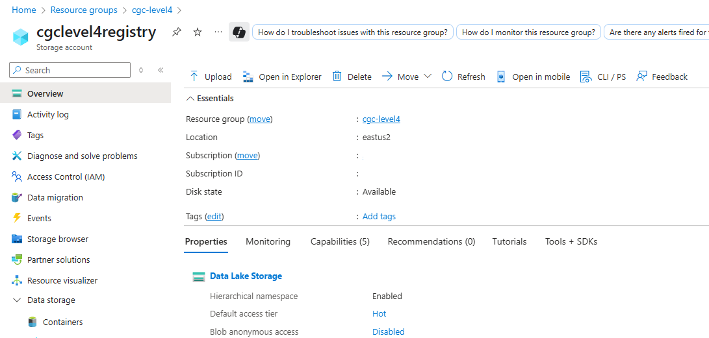
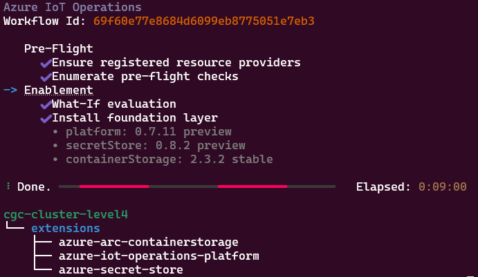
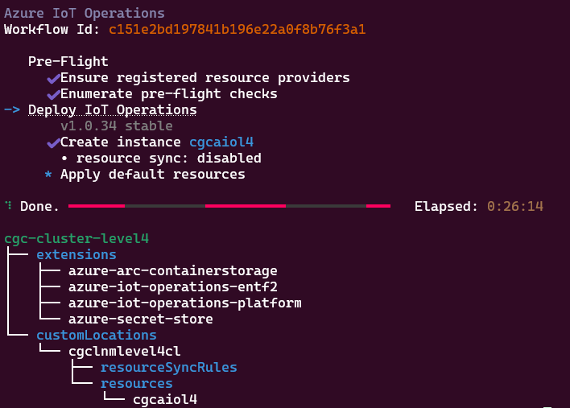
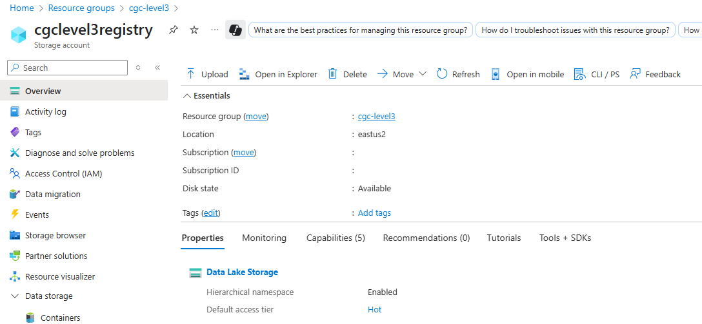
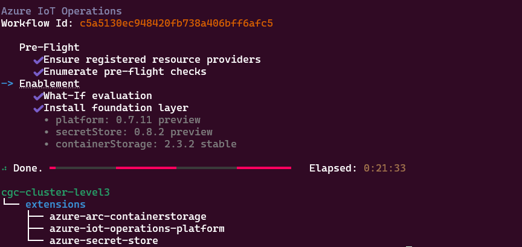
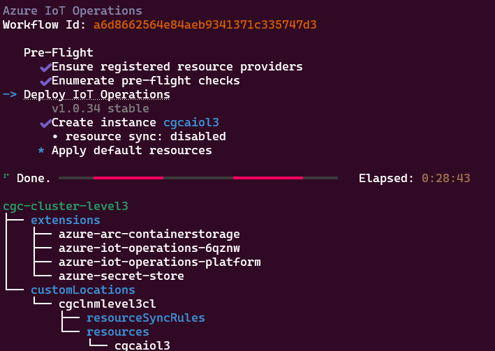
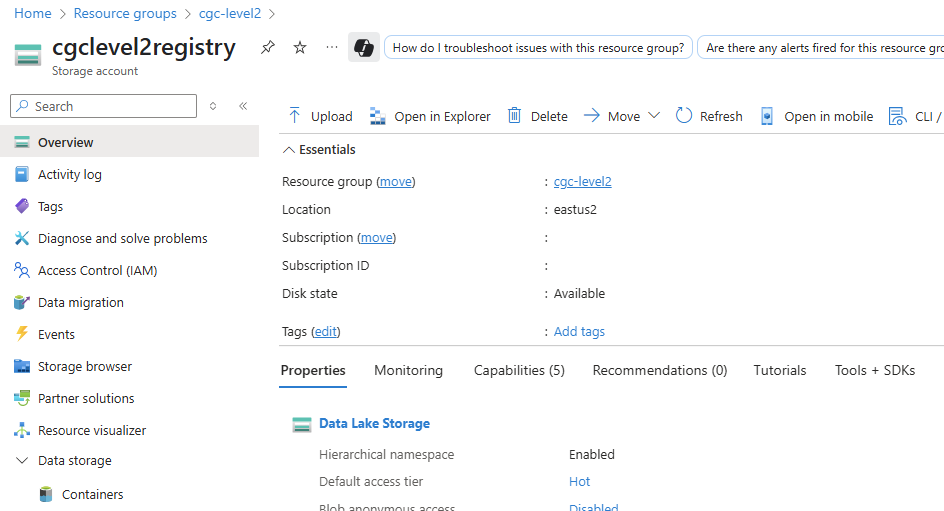
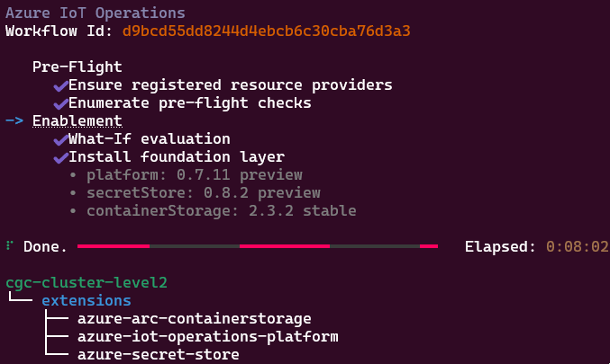
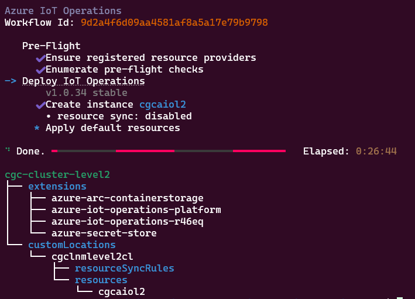

# Deploying Azure IoT Operations

In this section, you deploy a basic development Azure IoT Operations cluster to the Arc-enabled clusters on level2, level3, and level4. This process demonstrates building out all levels, but you don't need to deploy every level if you don't plan to move data to the cloud. For production use, follow the Azure IoT Operations documentation for production deployments.

## Prerequisites

- The jump box is set up as outlined in [preparing the jump box](./configure-infrastructure.md#preparing-the-jump-box). Make sure it's set up to communicate with each cluster by switching context.

- Contributor access to an Azure subscription where you deploy the instance

- Finish [Arc enable the K3s clusters](./arc-enable-clusters.md).

## Special Notes

> [!NOTE]
>
> Because deployment at some lower levels can take time, the Azure CLI can require you to sign in again during the process. In some cases, after the second deployment, the `az iot ops create` command appears to sit idle and doesn't show the "Azure IoT Operations with Workflow Id". If this happens, cancel the operation, sign in again (`az login --use-device-code`), and check that the subscription is correct before retrying.

## Deploy AIO to level4

1. Set the environment variables for level4.

    ```bash
    SUBSCRIPTION_ID="<Subscription_Id>"
    
    # A list can be retrieved using 
    # az account list-locations --query "sort_by([].{Location:name}, &Location)" -o table
    LOCATION="<Azure_Location>"
    
    # The resource group the cluster was deployed to
    RESOURCE_GROUP="<Resource_Group>"
    CLUSTER_NAME="<Cluster_Name>"
    
    # Schema registry details
    STORAGE_ACCOUNT="<Storage_Account_Name>"
    CONTAINER_NAME="<Container_Name>"
    SCHEMA_REGISTRY_NAME="<Schema_Registry_Name>"
    SCHEMA_NAMESPACE="<Schema_Registry_Namespace>"
    
    # AIO Instance Deployment
    CUSTOM_LOCATION="<Custom_Location_Name>"
    AIO_INSTANCE="<AIO_Instance_Name>"
    ```

1. Sign in to your subscription.

    ```bash
    # When prompted copy the code provided and log in to Azure using the link provided
    az login --use-device-code
    
    az account set -s "${SUBSCRIPTION_ID}"
    ```

1. Create the schema registry.

    ```bash
    # Create a storage account in the same resource group as the cluser
    az storage account create --name "${STORAGE_ACCOUNT}" --resource-group "${RESOURCE_GROUP}" --sku Standard_LRS --kind StorageV2 --hierarchical-namespace true --allow-shared-key-access false
    
    # Create the container
    az storage container create --name "${CONTAINER_NAME}" --account-name "${STORAGE_ACCOUNT}" --auth-mode login
    
    # Create the schema registry
    az iot ops schema registry create  --subscription "${SUBSCRIPTION_ID}"  -g "${RESOURCE_GROUP}"  -n ${SCHEMA_REGISTRY_NAME}  --registry-namespace ${SCHEMA_NAMESPACE}  --sa-resource-id /subscriptions/${SUBSCRIPTION_ID}/resourcegroups/${RESOURCE_GROUP}/providers/Microsoft.Storage/storageAccounts/${STORAGE_ACCOUNT}  --sa-container ${CONTAINER_NAME}
    
    ```

    


1. Initialize the cluster for Azure IoT Operations

    ```bash
    # Initialize the cluster for AIO
    az iot ops init  --subscription "${SUBSCRIPTION_ID}"  -g "${RESOURCE_GROUP}"  --cluster "${CLUSTER_NAME}"
    
    ```

    

1. Deploy Azure IoT Operations to the cluster.

    ```bash
    # Deploy AIO
    az iot ops create  --subscription "${SUBSCRIPTION_ID}"  -g "${RESOURCE_GROUP}"  --cluster "${CLUSTER_NAME}"  --custom-location ${CUSTOM_LOCATION}  -n ${AIO_INSTANCE}  --sr-resource-id /subscriptions/${SUBSCRIPTION_ID}/resourceGroups/${RESOURCE_GROUP}/providers/Microsoft.DeviceRegistry/schemaRegistries/${SCHEMA_REGISTRY_NAME}  --broker-frontend-replicas 1  --broker-frontend-workers 1  --broker-backend-part 1  --broker-backend-workers 1  --broker-backend-rf 2  --broker-mem-profile Low
    ```

    

## Deploy AIO to level3

1. Set the environment variables for the level3

    ```bash
    SUBSCRIPTION_ID="<Subscription_Id>"
    
    # A list can be retrieved using 
    # az account list-locations --query "sort_by([].{Location:name}, &Location)" -o table
    LOCATION="<Azure_Location>"
    
    # The resource group the cluster was deployed to
    RESOURCE_GROUP="<Resource_Group>"
    CLUSTER_NAME="<Cluster_Name>"
    
    # Schema registry details
    STORAGE_ACCOUNT="<Storage_Account_Name>"
    CONTAINER_NAME="<Container_Name>"
    SCHEMA_REGISTRY_NAME="<Schema_Registry_Name>"
    SCHEMA_NAMESPACE="<Schema_Registry_Namespace>"
    
    # AIO Instance Deployment
    CUSTOM_LOCATION="<Custom_Location_Name>"
    AIO_INSTANCE="<AIO_Instance_Name>"
    ```

1. Set Azure to the right subscription.

    ```bash
    # When prompted copy the code provided and log in to Azure using the link provided
    az login --use-device-code
    
    az account set -s "${SUBSCRIPTION_ID}"
    ```

1. Create the schema registry.

    ```bash
    # Create a storage account in the same resource group as the cluser
    az storage account create --name "${STORAGE_ACCOUNT}" --resource-group "${RESOURCE_GROUP}" --sku Standard_LRS --kind StorageV2 --hierarchical-namespace true
    
    # Create the container
    az storage container create --name "${CONTAINER_NAME}" --account-name "${STORAGE_ACCOUNT}" --auth-mode login
    
    # Create the schema registry
    az iot ops schema registry create  --subscription "${SUBSCRIPTION_ID}"  -g "${RESOURCE_GROUP}"  -n ${SCHEMA_REGISTRY_NAME}  --registry-namespace ${SCHEMA_NAMESPACE}  --sa-resource-id /subscriptions/${SUBSCRIPTION_ID}/resourcegroups/${RESOURCE_GROUP}/providers/Microsoft.Storage/storageAccounts/${STORAGE_ACCOUNT}  --sa-container ${CONTAINER_NAME}
    
    ```

    

1. Initialize the cluster for Azure IoT Operations.

    ```bash
    # Initialize the cluster for AIO
    az iot ops init  --subscription "${SUBSCRIPTION_ID}"  -g "${RESOURCE_GROUP}"  --cluster "${CLUSTER_NAME}"
    ```

    

1. Deploy Azure IoT Operations to the cluster.

    ```bash
    # Deploy AIO
    az iot ops create  --subscription "${SUBSCRIPTION_ID}"  -g "${RESOURCE_GROUP}"  --cluster "${CLUSTER_NAME}"  --custom-location ${CUSTOM_LOCATION}  -n ${AIO_INSTANCE}  --sr-resource-id /subscriptions/${SUBSCRIPTION_ID}/resourceGroups/${RESOURCE_GROUP}/providers/Microsoft.DeviceRegistry/schemaRegistries/${SCHEMA_REGISTRY_NAME}  --broker-frontend-replicas 1  --broker-frontend-workers 1  --broker-backend-part 1  --broker-backend-workers 1  --broker-backend-rf 2  --broker-mem-profile Low  
    ```

    

## Deploy AIO to level2

1. Set the environment variables for level2.

    ```bash
    SUBSCRIPTION_ID="<Subscription_Id>"
    
    # A list can be retrieved using 
    # az account list-locations --query "sort_by([].{Location:name}, &Location)" -o table
    LOCATION="<Azure_Location>"
    
    # The resource group the cluster was deployed to
    RESOURCE_GROUP="<Resource_Group>"
    CLUSTER_NAME="<Cluster_Name>"
    
    # Schema registry details
    STORAGE_ACCOUNT="<Storage_Account_Name>"
    CONTAINER_NAME="<Container_Name>"
    SCHEMA_REGISTRY_NAME="<Schema_Registry_Name>"
    SCHEMA_NAMESPACE="<Schema_Registry_Namespace>"
    
    # AIO Instance Deployment
    CUSTOM_LOCATION="<Custom_Location_Name>"
    AIO_INSTANCE="<AIO_Instance_Name>"
    ```

1. Sign in to your subscription.

    ```bash
    # When prompted copy the code provided and log in to Azure using the link provided
    az login --use-device-code
    
    az account set -s "${SUBSCRIPTION_ID}"
    ```

1. Create the schema registry.

    ```bash
    # Create a storage account in the same resource group as the cluser
    az storage account create --name "${STORAGE_ACCOUNT}" --resource-group "${RESOURCE_GROUP}" --sku Standard_LRS --kind StorageV2 --hierarchical-namespace true
    
    # Create the container
    az storage container create --name "${CONTAINER_NAME}" --account-name "${STORAGE_ACCOUNT}" --auth-mode login
    
    # Create the schema registry
    az iot ops schema registry create  --subscription "${SUBSCRIPTION_ID}"  -g "${RESOURCE_GROUP}"  -n ${SCHEMA_REGISTRY_NAME}  --registry-namespace ${SCHEMA_NAMESPACE}  --sa-resource-id /subscriptions/${SUBSCRIPTION_ID}/resourcegroups/${RESOURCE_GROUP}/providers/Microsoft.Storage/storageAccounts/${STORAGE_ACCOUNT}  --sa-container ${CONTAINER_NAME}
    ```

    

1. Initialize the cluster for Azure IoT Operations.

    ```bash
    
    # Initialize the cluster for AIO
    az iot ops init  --subscription "${SUBSCRIPTION_ID}"  -g "${RESOURCE_GROUP}"  --cluster "${CLUSTER_NAME}"
    
    ```
    
    
  
1. Deploy Azure IoT Operations to the cluster.

    ```bash
    # Deploy AIO
    az iot ops create  --subscription "${SUBSCRIPTION_ID}"  -g "${RESOURCE_GROUP}"  --cluster "${CLUSTER_NAME}"  --custom-location ${CUSTOM_LOCATION}  -n ${AIO_INSTANCE}  --sr-resource-id /subscriptions/${SUBSCRIPTION_ID}/resourceGroups/${RESOURCE_GROUP}/providers/Microsoft.DeviceRegistry/schemaRegistries/${SCHEMA_REGISTRY_NAME}  --broker-frontend-replicas 1  --broker-frontend-workers 1  --broker-backend-part 1  --broker-backend-workers 1  --broker-backend-rf 2  --broker-mem-profile Low  
    ```
    
    
  
## Next steps

Learn how to send asset telemetry through deployments to Azure Event Hubs in [Flow asset telemetry](./asset-telemetry.md).