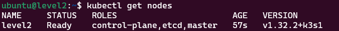

# Prerequisites

Set up Purdue networking with these networks (Purdue rules in place):
- Default network (can use all others and be used from all others): 192.168.0.0/24
- Level4: 192.168.104.0/24
- Level3: 192.168.103.0/24
- Level2: 192.168.102.0/24
- A small form factor machine, or a Windows WSLv2 with Ubuntu 22.04 LTS, attached to the default network and has internet access
- A small form factor machine that works as a single node cluster in Level4, Level3, and Level2, but starts connected to the default network (Beelink AMD Ryzen 7 5000 series)
- Meet minimum requirements for AIO
- Ubuntu 22.04 LTS installed

## Preparing the jump box

The jump box is where you run operations and connect to the Kubernetes cluster and Arc. Using a jump box makes things easier and reduces the number of whitelisted addresses. If you run some of these steps on the actual machine, you need to open additional ports and allow more URIs. In a real-world scenario, customers either use a similar technique or manage these machines in other ways. This guidance isn't a prescriptive operations guide, so this approach is acceptable.

In this example, the jump box is an Ubuntu 22.04 WSLv2 instance.

1. If you've used this machine to connect to other machines, clear the entries for the new machines from the known hosts file (`~/.ssh/known_hosts`).

1. Install the kubectl client on the machine and create the required configuration file.

    ```bash
    sudo  DEBIAN_FRONTEND=noninteractive NEEDRESTART_MODE=a apt update -y && sudo  DEBIAN_FRONTEND=noninteractive NEEDRESTART_MODE=a apt install -y apt-transport-https ca-certificates curl gnupg
    
    # Download the signing key for Kubernetes repository
    curl -fsSL https://packages.cloud.google.com/apt/doc/apt-key.gpg | sudo apt-key add -
    
    # Add the apt repository
    sudo bash -c 'cat <<EOF >/etc/apt/sources.list.d/kubernetes.list
    deb https://apt.kubernetes.io/ kubernetes-xenial main
    EOF'
    
    sudo DEBIAN_FRONTEND=noninteractive NEEDRESTART_MODE=a apt update -y && sudo DEBIAN_FRONTEND=noninteractive NEEDRESTART_MODE=a apt install -y kubectl
    
    # Test the installation
    kubectl version
    ```

1. Install Azure CLI.

    ```bash
    curl -sL https://aka.ms/InstallAzureCLIDeb | sudo bash 
    
    # Test it
    az version
    ```

1. Install the Docker CLI and download the Envoy image for use later in the Kubernetes deployment.

    ```bash
    sudo  DEBIAN_FRONTEND=noninteractive NEEDRESTART_MODE=a apt install -y docker-ce-cli
    
    docker pull envoyproxy/envoy:v1.33.0
    docker save -o ./envoy_v1.33.0.tar envoyproxy/envoy:v1.33.0
    chown ${USER} ./envoy_v1.33.0.tar && chmod 777 ./envoy_v1.33.0.tar
    ```

1. Install the MQTT client tools.

    ```bash
    sudo DEBIAN_FRONTEND=noninteractive NEEDRESTART_MODE=a apt update -y && sudo DEBIAN_FRONTEND=noninteractive NEEDRESTART_MODE=a apt upgrade -y && sudo DEBIAN_FRONTEND=noninteractive NEEDRESTART_MODE=a apt install -y mosquitto-clients
    
    wget https://github.com/EdJoPaTo/mqttui/releases/download/v0.22.0/mqttui-v0.22.0-x86_64-unknown-linux-gnu.deb
    chmod 777 ./mqttui-v0.22.0-x86_64-unknown-linux-gnu.deb
    sudo dpkg -i ./mqttui-v0.22.0-x86_64-unknown-linux-gnu.deb
    ```

## Preparing Each Small Form Factor Machine (Starting at Jump Box)

The steps in this section will be completed for each of the machines that are to be deployed to the various Purdue levels. The host name for each machine will be set to "level\<number\>" to reflect its Purdue level i.e., Purdue Level 4 will be level4. Start with the machines attached to the Default network and review the IP Address they have been assigned making note of each. 

1. Copy the required files to the remote machine.

    ```bash
    scp -r ./k3s ubuntu@<IP_Address>:~/
    ```

1. Establish an SSH session to the target machine using the IP address you recorded earlier.

    ```bash
    ssh ubuntu@<IP_Address>
    ```
1. Add the current user to the list of users who don't need to enter a password when running sudo commands. When prompted, enter the Ubuntu password.

    ```bash
    sudo cp /etc/sudoers /etc/sudoers.bak && sudo ls && echo "${USER} ALL=(ALL) NOPASSWD:ALL" | sudo tee -a /etc/sudoers
    ```

1. Update the host name and adjust the hosts file to match.

    ```bash
    oldHostName=${HOSTNAME}
    
    sudo hostnamectl set-hostname <Host_Name>
    sudo sed -i "/127.0.1.1 ${oldHostName}/c\\127.0.1.1 level<level>" /etc/hosts
    ```

1. Update the OS and packages, installing some basics.

    ```bash
    sudo DEBIAN_FRONTEND=noninteractive NEEDRESTART_MODE=a apt update -y && sudo DEBIAN_FRONTEND=noninteractive NEEDRESTART_MODE=a apt upgrade -y && sudo DEBIAN_FRONTEND=noninteractive NEEDRESTART_MODE=a apt install -y nano wget curl iputils-ping ca-certificates
    ```
1. Disable the firewall to make troubleshooting easier during the demo.

    ```bash
    sudo ufw disable && sudo systemctl stop ufw
    ```
1. Set up the K3s files required for an air-gapped install. If you're working with level4, you can load files from the internet instead.

    ```bash
    sudo mkdir -p /var/lib/rancher/k3s/agent/images/ && sudo cp k3s/k3s-airgap-images-amd64.tar.zst /var/lib/rancher/k3s/agent/images/ && sudo chown ${USER} /var/lib/rancher/k3s/agent/images/k3s-airgap-images-amd64.tar.zst && sudo chmod 755 /var/lib/rancher/k3s/agent/images/k3s-airgap-images-amd64.tar.zst
    
    sudo cp k3s/k3s /usr/local/bin/ && sudo chown ${USER} /usr/local/bin/k3s && sudo chmod 777 /usr/local/bin/k3s
    
    sudo chown ${USER} k3s/install.sh && sudo chmod 755 k3s/install.sh
    ```
1. Install K9s to visualize the cluster.

    ```bash
    tar xf k3s/k9s_Linux_amd64.tar.gz && sudo mv k9s /usr/local/bin && rm LICENSE && rm README.md
    
    # type k9s to start the visualization and ctl+c to exit it
    ```
1. Configure the network settings, but don't apply the changes from the remote machine to avoid locking up the session when the IP changes. This step sets the machine's IP address and DNS names. For example, use 192.168.10\<number\>.10 (such as 192.168.104.10 for level 4) with a default gateway of 192.168.10\<number\>.1 (such as 192.168.104.1 for level 4). Enter your preferred DNS servers in the "addresses" section. For this sample constrained network, level 4 uses Google DNS servers, and levels 2 and 3 use only their default gateway as the DNS server.

    ```bash
    #24.04
    # NET_CONFIG_FILE=$(ls /etc/netplan/*-init.yaml)
    
    # 22.04
    NET_CONFIG_FILE=$(ls /etc/netplan/*-config.yaml)
    
    NET_CONFIG_SETTINGS="      addresses:\n        - 192.168.10<number>.10/24\n      nameservers:\n        addresses: [<dns_servers>]\n      routes:\n        - to: default\n          via: 192.168.10<number>.1" && NET_CONFIG_OLD_SETTINGS="      dhcp4: true"
    
    sudo sed -i "/${NET_CONFIG_OLD_SETTINGS}/c\\${NET_CONFIG_SETTINGS}" ${NET_CONFIG_FILE} && sudo chmod 600 ${NET_CONFIG_FILE}
    ```
 1. Exit the SSH session. From the console, shut down the machine, move it to the destination network, and power it up.

    ```bash
    # Exit the ssh session
    exit
    
    timeout 10s ssh ubuntu@<IP Address> "sudo  netplan apply"
    
    # On the console
    sudo shutdown now
    
    # Move to the location and start the machine
    ```
 1. After you power up the machine, connect to the new IP address to finish the K3s installation and test the setup.

    ```bash
    ssh ubuntu@192.168.10<level>
    
    # Install Kubernetes in the final spot using Air Gapped procedure
    sudo INSTALL_K3S_SKIP_DOWNLOAD=true K3S_TOKEN=SECRET ./k3s/install.sh server --secrets-encryption --cluster-init  --disable=traefik --write-kubeconfig-mode 644
    
    mkdir -p ~/.kube && cp /etc/rancher/k3s/k3s.yaml ~/.kube/config
    
    echo 'export KUBECONFIG=~/.kube/config' | tee -a ~/.bashrc && echo 'export KUBE_EDITOR="nano"' | tee -a ~/.bashrc
    
    source ~/.bashrc
    
    # Proceed after the following shows a Status of ready
    kubectl get nodes
    ```

    

## Completing the jump box configuration

1. Make sure all Small Form Factor Machines are prepared and running in their target locations.

1. Prepare the jump box by making sure the ~/.kube/config file exists

    ```bash
    # Ensure the ~/.kube/config file exists on the jump box
    mkdir -p ~/.kube && touch ~/.kube/config
    
    # Back up the existing config file
    cp ~/.kube/config ~/.kube/config.bak
    ```


1. Merge the kubectl config file with a copy from each Small Form Factor Machine. Repeat these steps for each target machine.

    ```bash
    scp ubuntu@192.168.10<level>.10:~/.kube/config ./kube-config-temp
    
    sudo sed -i "s/127.0.0.1/192.168.10<level>.10/g" ./kube-config-temp && sudo sed -i "s/  name: default/  name: level<level>/g" ./kube-config-temp && sudo sed -i "s/current-context: default/current-context: level<level>/g" ./kube-config-temp && sudo sed -i "s/    cluster: default/    cluster: level<level>/g" ./kube-config-temp && sudo sed -i "s/- name: default/- name: ubuntul<level>/g" ./kube-config-temp && sudo sed -i "s/    user: default/    user: ubuntul<level>/g" ./kube-config-temp
    
    sudo chmod 644 ./kube-config-temp
    KUBECONFIG=~/.kube/config:./kube-config-temp kubectl config view --flatten > ./kube-config-temp-flat
    
    rm ~/.kube/config && mv ./kube-config-temp-flat ~/.kube/config
    
    rm ./kube-config-temp 
    ```

1. Test each cluster to make sure it works from the jump box.

    ```bash
    # Get a list of the available contexts (should see level2, level3, and level4)
    kubectl config get-contexts
    
    # Change to another context
    kubectl config use-context level<level>
    
    # View the cluster
    kubectl get nodes
    ```

## Next steps

1. Learn [How Azure IoT Operations works in a layered network](./aio-layered-network.md).
1. Learn how to use CoreDNS and Envoy Proxy in [Configure the infrastructure](./configure-infrastructure.md).
1. Learn how to Arc enable the K3s clusters in [Arc enable the K3s clusters](./arc-enable-clusters.md).
1. Learn how to deploy Azure IoT Operations to the clusters in [Deploy Azure IoT Operations](./deploy-aio.md).
1. Learn how to flow asset telemetry through the deployments into Azure Event Hubs in [Flow asset telemetry](./asset-telemetry.md).