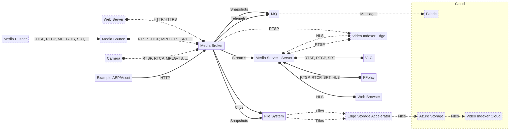

# Azure IoT Operations media connector demo

## Introduction

This document describes the Azure IoT Operations media connector demo package.

The Azure IoT Operations media connector is part of the Azure IoT Operations platform. It's designed to be secure, scalable and fault-tolerant. It's responsible for the ingestion, storage, and distribution of media content; it also takes care of the management of media metadata and the generation of media thumbnails.

To learn more, see [What is the Azure IoT Operations media connector?](https://learn.microsoft.com/azure/iot-operations/discover-manage-assets/overview-media-connector)

The demo environment consists of the following components:



The dotted lines represent connections and components that are possible but not show in the demo package.

## Prerequisites

To install the prerequisites, use the following instructions:

### Windows

Run these commands from the command line:

```cmd
winget install -e --id Microsoft.PowerShell
winget install -e --id Kubernetes.kubectl
winget install -e --id Microsoft.Azure.Kubelogin
winget install -e --id Microsoft.AzureCLI
winget install -e --id Helm.Helm
winget install -e --id EclipseFoundation.Mosquitto
```

You might need to add **C:\Program Files\mosquitto** and **helm.exe** to your PATH.

### Ubuntu GNU/Linux

Use the following links to install the required tools:

- [PowerShell](https://learn.microsoft.com/powershell/scripting/install/install-ubuntu)
- [Azure CLI](https://learn.microsoft.com/cli/azure/install-azure-cli-linux)
- [Helm](https://helm.sh/docs/intro/install/)
- [kubectl](https://kubernetes.io/docs/tasks/tools/install-kubectl-linux/)

To install the **mosquitto** clients, run:

```bash
sudo apt install mosquitto-clients
```

## Get started

1. The scripts are designed to run on PowerShell 7 or newer. To test if you have the necessary prerequisites, run the `Test-Prerequisites.ps1` script. The demo files should be in a path without spaces.
1. [Deploy Azure IoT Operations](https://learn.microsoft.com/azure/iot-operations/deploy-iot-ops/overview-deploy). The Azure IoT Operations Kubernetes cluster should be configured as the `kubectl` current context.
1. To install the sample media server, use the files in the `media-server/` folder.
1. You should have a listener without TLS configured on port 1883. Use the files in the `broker-listener/` folder to deploy a suitable listener.
1. To verify the listener is accessible, run the `Update-AioMqEndpointFile.ps1` script.
1. Run the various test scripts, `Invoke-Test*.ps1`, to try out different scenarios:

   - `Invoke-TestSnapshotToMqttAutostart.ps1` takes snapshots from the demo stream and publishes them to the MQTT broker.
   - `Invoke-TestSnapshotToFsAutostart.ps1` takes snapshots from the demo stream and writes them as files to the file system.
   - `Invoke-TestClipToFsAutostart.ps1` creates clips at regular intervals from the demo stream and writes them as files to the file system.
   - `Invoke-TestStreamToRtspAutostart.ps1` pushes the demo stream to a media server, from where you can retrieve it.
   
   Each script deploys an asset endpoint and asset, and then monitors their activity. Use `Ctrl+C` to end the monitoring, remove the asset endpoint and asset, and terminate the script.

## Changes since Azure IoT Operations M2 and M3 preview releases

- Additional test scripts have been added to demonstrate the capabilities of the Azure IoT Operations media connector.
- Uses PowerShell scripts instead of Polyglot notebooks.

## Limitations

The Azure IoT Operations media connector has the following limitations:

- No discovery, this will be implemented by the connector for ONVIF that's currently in development.
- Limits to the number of concurrent connections and use of the file system are not enforced.
- Performance and footprint are not optimized.
- The mRPC API is not publicly documented yet and is subject to change.

## Description of package contents:

- **README.md**: This file.
- **media-connector-demo.mermaid and produced .png and .svg**: Diagram of the demo environment.
- **MQTT client container (mqtt-client)**: This folder contains PowerShell scripts and kubernetes resources that show how to deploy a container with an MQTT client configured for secure access.
- **Broker listener (broker-listener/)**: This folder contains PowerShell scripts and kuberentes resources that show how to deploy an open (non-TLS) listener for MQ.
- **Media Server (media-server/)**: This folder contains scripts and yaml files that demonstrates how to deploy a media server in a kubernetes cluster.
- **resources/aep-*.yaml**: Example asset endpoints that you can use to configure the media connector.
- **resources/asset-*.yaml**: Example assets that you can use to configure the media connector.
- **Install-ResourceFile.ps1**: This PowerShell script installs a kubernetes resource file for the Azure IoT Operations media connector.
- **Uninstall-ResourceFile.ps1**: This PowerShell script uninstalls a kubernetes resource file for the Azure IoT Operations media connector.
- **Invoke-Test*.ps1**: These PowerShell scripts run different test scenarios for the Azure IoT Operations media connector.
- **Start-InteractiveSession.ps1**: This PowerShell script starts an interactive session in the Azure IoT Operations media connector container.
- **Start-MqttListener.ps1**: This PowerShell script starts an MQTT listener on the Azure IoT Operations MQTT broker.
- **Start-FileSystemMonitor.ps1**: This PowerShell script starts monitoring for file changes on the Azure IoT Operations media connector container.
- **Start-RtspStreamViewer.ps1**: This PowerShell script starts the default browser to look at the RTSP stream from the default media server.
