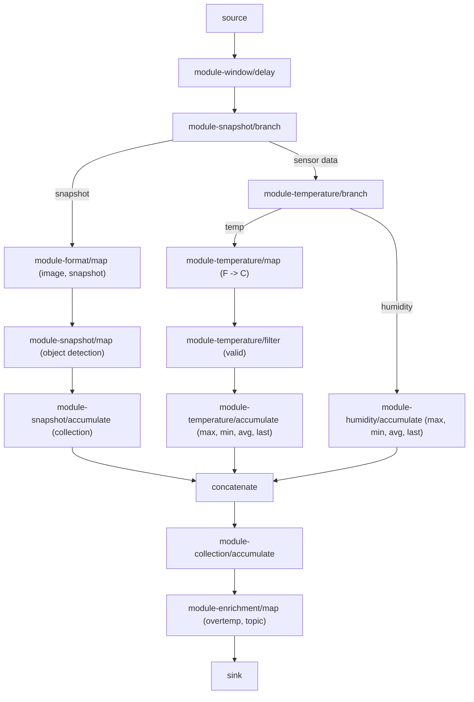

# Azure IoT Operations WASM Data Flow Graphs - Samples

This repository contains sample WebAssembly (WASM) modules and graph definitions for [Azure IoT Operations data flow graphs](https://learn.microsoft.com/azure/iot-operations/connect-to-cloud/howto-dataflow-graph-wasm). These samples demonstrate how to build custom data processing workflows using WASM modules in Rust and Python.

## Quick Start

1. **Get the samples**: Clone this repository and explore the examples
2. **Learn the concepts**: Read the [data flow graphs overview](https://learn.microsoft.com/azure/iot-operations/connect-to-cloud/howto-dataflow-graph-wasm)
3. **Build your own**: Follow the [WASM development guide](https://learn.microsoft.com/azure/iot-operations/connect-to-cloud/howto-develop-wasm-modules)

## Prerequisites

- Azure IoT Operations deployed on an Arc-enabled Kubernetes cluster
- Azure Container Registry for storing WASM modules
- ORAS CLI for pushing artifacts
- For development: Rust toolchain or Python 3.8+

## Repository Structure

```
samples/wasm/
├── graph-simple.yaml          # Basic temperature conversion graph
├── graph-complex.yaml         # Multi-sensor processing graph
├── rust/
│   ├── examples/              # Rust operator implementations
│   │   ├── temperature/       # Temperature conversion module
│   │   ├── humidity/          # Humidity processing module
│   │   ├── otel-enrich/       # Otel enrich module
│   │   ├── otel-transform/    # Otel transformation module
│   │   ├── format/            # Data formatting module
│   │   ├── collection/        # Data collection module
│   │   ├── enrichment/        # Data enrichment module
│   │   ├── snapshot/          # Image/snapshot processing
│   │   └── window/            # Windowing operations
│   └── Dockerfile             # Rust WASM builder
└── python/
    ├── examples/              # Python operator implementations
    │   ├── map/               # Map operator example
    │   ├── filter/            # Filter operator example
    │   └── branch/            # Branch operator example
    ├── schema/                # WIT schema definitions
    └── Dockerfile             # Python WASM builder
```

**Browse the code**:
- [Graph definitions](.) - YAML configuration files  
- [Rust examples](rust/examples) - Complete Rust operator implementations
- [Python examples](python/examples) - Complete Python operator implementations
- [Rust builder](rust/Dockerfile) - Rust WASM build environment
- [Python builder](python/Dockerfile) - Python WASM build environment

## Building Modules

### Using Docker Builders (Recommended)

**Rust modules:**
```bash
# In your Rust project directory
docker run --rm -v "$(pwd):/workspace" ghcr.io/azure-samples/explore-iot-operations/rust-wasm-builder --app-name my-module

# Debug build
docker run --rm -v "$(pwd):/workspace" ghcr.io/azure-samples/explore-iot-operations/rust-wasm-builder --app-name my-module --build-mode debug
```

**Python modules:**
```bash
# In your Python project directory  
docker run --rm -v "$(pwd):/workspace" ghcr.io/azure-samples/explore-iot-operations/python-wasm-builder --app-name my_module --app-type map

# Debug build
docker run --rm -v "$(pwd):/workspace" ghcr.io/azure-samples/explore-iot-operations/python-wasm-builder --app-name my_module --app-type map --build-mode debug
```

### Local Development

For local development setup and detailed instructions, see the [WASM development guide](https://learn.microsoft.com/azure/iot-operations/connect-to-cloud/howto-develop-wasm-modules).

For complete examples:
- **[Rust examples](rust/examples)** - Complete operator implementations in Rust
- **[Python examples](python/examples)** - Complete operator implementations in Python

## Example Workflows

### Simple Temperature Conversion

Convert Fahrenheit to Celsius using a single WASM module ([graph-simple.yaml](graph-simple.yaml)):

```yaml
# graph-simple.yaml
operations:
  - operationType: "source"
    name: "temperature-source"
  - operationType: "map"
    name: "temperature/map"
    module: "temperature:1.0.0"
  - operationType: "sink"
    name: "temperature-sink"
```

Input: `{"temperature": {"value": 100.0, "unit": "F"}}`  
Output: `{"temperature": {"value": 37.8, "unit": "C"}}`

### Complex Multi-Sensor Processing

Process temperature, humidity, and image data with branching and aggregation ([graph-complex.yaml](graph-complex.yaml)):



## Operator Types

| Operator | Purpose | Example Use Case |
|----------|---------|------------------|
| **Map** | Transform data | Unit conversion, format changes |
| **Filter** | Allow/reject data | Remove invalid readings |
| **Branch** | Route conditionally | Separate sensor types |
| **Accumulate** | Aggregate over time | Calculate statistics |
| **Delay** | Control timing | Batch processing |

## Deployment

1. **Build your modules** using the builders above
2. **Push to registry**:
   ```bash
   oras push myregistry.azurecr.io/my-graph:1.0.0 graph.yaml
   oras push myregistry.azurecr.io/my-module:1.0.0 module.wasm
   ```
3. **Deploy data flow graph** - see [deployment guide](https://learn.microsoft.com/azure/iot-operations/connect-to-cloud/howto-dataflow-graph-wasm#configure-the-data-flow-graph)

## Operator Examples

### Rust Map Operator

Example from [temperature converter](rust/examples/temperature):

```rust
use tinykube_wasm_sdk::macros::map_operator;
use tinykube_wasm_sdk::logger::{self, Level};

#[map_operator(init = "init")]
fn process(input: DataModel) -> DataModel {
    // Transform your data here
    logger::log(Level::Info, "my-operator", "Processing data");
    input
}

fn init(_config: ModuleConfiguration) -> bool {
    true
}
```

### Python Filter Operator

Example from [Python examples](python/examples):

```python
from filter_impl import exports
from filter_impl.imports import types

class Filter(exports.Filter):
    def process(self, message: types.DataModel) -> bool:
        # Return True to pass, False to filter out
        return True
```

## Documentation

For complete guides and reference documentation:

- **[Data Flow Graphs Overview](https://learn.microsoft.com/azure/iot-operations/connect-to-cloud/howto-dataflow-graph-wasm)** - Understand concepts and deployment
- **[WASM Development Guide](https://learn.microsoft.com/azure/iot-operations/connect-to-cloud/howto-develop-wasm-modules)** - Build custom modules in Rust and Python
- **[Configuration Reference](https://learn.microsoft.com/azure/iot-operations/connect-to-cloud/howto-dataflow-graph-wasm#configuration-reference)** - Complete configuration options